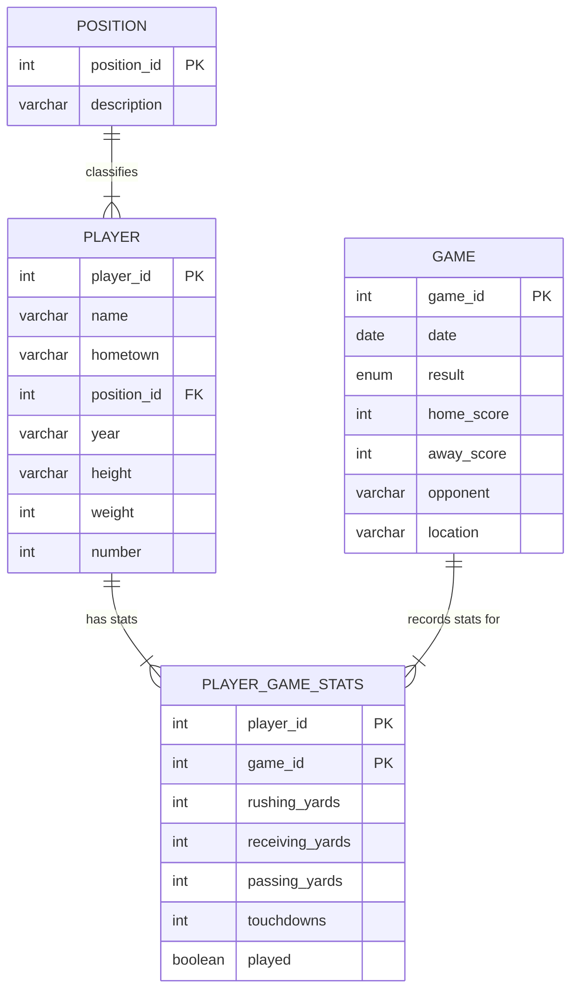

```mermaid

erDiagram
    PLAYER {
        int player_id PK
        varchar name
        varchar hometown
        int position_id FK
        varchar year
        varchar height
        int weight
        int number
    }

    POSITION {
        int position_id PK
        varchar description
    }

    GAME {
        int game_id PK
        date date
        enum result
        int home_score
        int away_score
        varchar opponent
        varchar location
    }

    PLAYER_GAME_STATS {
        int player_id PK
        int game_id PK
        int rushing_yards
        int receiving_yards
        int passing_yards
        int touchdowns
        boolean played
    }

    PLAYER ||--|{ PLAYER_GAME_STATS : "has stats"
    GAME   ||--|{ PLAYER_GAME_STATS : "records stats for"
    POSITION ||--|{ PLAYER : "classifies"
    
```
