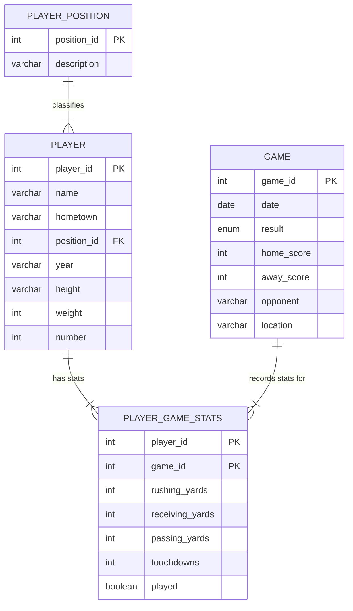

## Summary Report
* 2 or 3 paragraphs describing the business/organization/person that will use your database.
* 2 or 3 paragraphs describing how the database will be used from a user’s perspective

## ER Model


  The design of my database is fully normalized and has a relational structure that intends to store and analyze football player
  performance data across a full season. This database model separates the data into 4 distinct tables. We can see the basic information
  for each player on the team, each game in the season, and the positions on the team. Using those three tables, they can be combined to get the 4th
  table that describes each player's stats for every game. The tables depend solely on their primary keys, following the Third Normal Form. For example,
  player details such as jersey number, height, and hometown are stored only once in the Player table to prevent unnecessary duplication when generating
  statistics for multiple games.

  A key design choice I made was creating a junction table, player_game_stats, to represent the many-to-many relationship between players and games. To avoid
  this issue, the player_game_stats table has a composite primary key of player_id and game_id. This composite key is used to identify each performance
  entry uniquely. The stats table also limited the stats to the measurable performance metrics: rushing, receiving, passing, and touchdowns, which allows
  game-by-game analytics without repeating player or game attributes.

  The database also normalizes player positions by storing them in a separate player_position table. I could have kept the full position name for each player,
  but I decided to create a whole table for the position. The position_id serves as a foreign key in the player table that references a single record in the
  player_position table. Making this choice avoids inconsistency in position naming, makes updates easier, and maintains referential integrity. Overall, the
  design enforces clean separation of entities while supporting flexible reporting and efficient statistical queries.
  

  ### Player
  The player table stores personal and static information for each football player, such as name, class year, hometown, physical attributes, and jersey number.
  It links to the player_position table through a foreign key to classify each player. Each entry represents one unique athlete in the system.
  ### Player_Position
  The player_position table defines the set of football positions, each assigned to an ID number. Storing these in a separate table prevents duplication and ensures
  consistency. It is referenced by the player table to assign each player exactly one position category.
  ### Game
  The game table contains information on each scheduled game, including the date, opponent, location, and final scores. It serves as the parent entity for all
  statistics recorded during that game. Each entry represents one unique matchup.
  ### Player_Game_Stats
  The player_game_stats table records all performance statistics for a single player in a single game. Because players participate in multiple games, and games include
  multiple players, this table resolves the many-to-many relationship between player and game tables. It includes rushing, receiving, passing yards, touchdowns, and
  whether the player participated in that game. A player having zero stats because they did not participate means something different than a player having zero stats
  because they did not play.
## Tables
```sql

CREATE TABLE player (
	player_id integer auto_increment PRIMARY KEY,
	name varChar(100),
	hometown varChar(100),
	position_id integer,
	year varChar(20),
	height varChar(10),
	weight integer,
	number integer,
	FOREIGN KEY (position_id) REFERENCES player_position(position_id)
)ENGINE=InnoDB;

CREATE TABLE game (
	game_id integer auto_increment PRIMARY KEY,
	date DATE,
	result ENUM('W', 'L'),
	home_score integer,
	away_score integer,
	opponent varChar(100),
	location varChar(100)
)ENGINE=InnoDB;

CREATE TABLE player_position (
	position_id integer auto_increment PRIMARY KEY,
	description varChar(50)
)ENGINE=InnoDB;

CREATE TABLE player_game_stats(
	player_id integer,
	game_id integer,
	rushing_yards integer,
	receiving_yards integer,
	passing_yards integer,
	touchdowns integer,
	played boolean,
	PRIMARY KEY (player_id, game_id),
	FOREIGN KEY (player_id) REFERENCES player(player_id),
	FOREIGN KEY (game_id) REFERENCES game(game_id)
)ENGINE=InnoDB;
```

## Data
```sql

insert into player_position (position_id, description) VALUES
(1, 'Quarterback'),
(2, 'Running Back'),
(3, 'Tight End'),
(4, 'Wide Receiver');

insert into player (player_id, name, hometown, position_id, year, height, weight, number) VALUES
(1,	'Quinshon Judkins',	'Pike Road',	2,	'Junior',	'6-0',	219,	1),
(2,	'Emeka Egbuka',	'Steilacoom',	4,	'Graduate',	'6-1',	205,	2),
(3,	'Lincoln Kienholz',	'Pierre',	1,	'Sophomore',	'6-3',	207,	3),
(4,	'Jeremiah Smith',	'Miami Gardens',	4,	'Freshman',	'6-3',	215,	4),
(5,	'Mylan Graham',	'Fort Wayne',	4,	'Freshman',	'6-1',	185,	5),
(6,	'Jayden Ballard',	'Massillon',	4,	'Senior',	'6-2',	195,	9),
(7,	'Julian Sayin',	'Carlsbad',	1,	'Freshman',	'6-1',	203,	10),
(8,	'Brandon Inniss',	'Hollywood',	4,	'Sophomore',	'6-0',	203,	11),
(9,	'Air Noland',	'College Park',	1,	'Freshman',	'6-2',	192,	12),
(10,	'Bryson Rodgers',	'Tampa',	4,	'Sophomore',	'6-2',	185,	13),
(11,	'Kojo Antwi',	'Suwanee',	4,	'Junior',	'6-0',	194,	14),
(12,	'Jelani Thurman',	'Fairburn',	3,	'Sophomore',	'6-6',	258,	15),
(13,	'Mason Maggs',	'Dublin',	1,	'Junior',	'6-2',	224,	16),
(14,	'Carnell Tate',	'Chicago',	4,	'Sophomore',	'6-3',	191,	17),
(15,	'Will Howard',	'Downington',	1,	'Graduate',	'6-4',	235,	18),
(16,	'Chad Ray',	'Dublin',	1,	'Senior',	'6-2',	215,	19),
(17,	'James People',	'San Antonio',	2,	'Freshman',	'5-10',	203,	20),
(18,	'Nolan Baudo',	'Chicago',	4,	'Sophomore',	'5-10',	180,	23),
(19,	'Sam Dixon',	'Pickerington',	2,	'Freshman',	'5-11',	203,	24),
(20,	'Chase Brecht',	'Powell',	2,	'Junior',	'6-0',	205,	26),
(21,	'TC Caffey',	'Hubbard',	2,	'Junior',	'5-10',	215,	28),
(22,	'Rashid SeSay',	'Zanesville',	2,	'Freshman',	'5-11',	190,	30),
(23,	'TreVeyon Henderson',	'Hopewell',	2,	'Senior',	'5-10',	208,	32),
(24,	'Devin Brown',	'Gilbert',	1,	'Junior',	'6-3',	212,	33),
(25,	'Brennen Schramm',	'Medina',	4,	'Sophomore',	'6-0',	191,	34),
(26,	'Jace Middleton',	'Lewis Center',	3,	'Senior',	'6-4',	235,	46),
(27,	'Patrick Gurd',	'New Albany',	3,	'Senior',	'6-4',	249,	49),
(28,	'Shawn Lodge',	'Akron',	4,	'Junior',	'6-0',	170,	80),
(29,	'Damarion Witten',	'Cleveland',	4,	'Freshman',	'6-4',	215,	81),
(30,	'David Adolph',	'Dublin',	4,	'Junior',	'6-5',	209,	82),
(31,	'Joop Mitchell',	'Wyoming',	4,	'Senior',	'6-1',	180,	83),
(32,	'Dorian Williams',	'Cincinnati',	4,	'Freshman',	'6-2',	200,	84),
(33,	'Bennett Christian',	'Acworth',	3,	'Junior',	'6-6',	260,	85),
(34,	'Maxence LeBlanc',	'St-Bruno',	3,	'Freshman',	'6-4',	227,	86),
(35,	'Gee Scott Jr.',	'Seattle',	3,	'Graduate',	'6-3',	243,	88),
(36,	'Zak Herbstreit',	'Nashville',	3,	'Senior',	'6-2',	240,	89),
(37,	'Will Kacmarek',	'St. Louis',	3,	'Senior',	'6-6',	260,	89);

insert into game(game_id, date, result, home_score, away_score, opponent, location) VALUES
(1,	'2024-8-31',	'W',	52,	6,	'Akron',	'Ohio State'),
(2,	'2024-9-7',	'W',	56,	0,	'Western Michigan',	'Ohio State'),
(3,	'2024-9-21',	'W',	49,	14,	'Marshall',	'Ohio State'),
(4,	'2024-9-28',	'W',	7,	38,	'Michigan State',	'Michigan State'),
(5,	'2024-10-5',	'W',	35,	7,	'Iowa',	'Ohio State'),
(6,	'2024-10-12',	'L',	32,	31,	'Oregon',	'Oregon'),
(7,	'2024-10-26',	'W',	21,	17,	'Nebraska',	'Ohio State'),
(8,	'2024-11-2',	'W',	13,	20,	'Penn State',	'Penn State'),
(9,	'2024-11-9',	'W',	45,	0,	'Purdue',	'Ohio State'),
(10,	'2024-11-16',	'W',	7,	31,	'Northwestern',	'Northwestern'),
(11,	'2024-11-23',	'W',	38,	15,	'Indiana',	'Ohio State'),
(12,	'2024-11-30',	'L',	10,	13,	'Michigan',	'Ohio State'),
(13,	'2024-12-21',	'W',	42,	17,	'Tennessee',	'Ohio State'),
(14,	'2025-1-1',	'W',	21,	41,	'Oregon',	'Rose Bowl'),
(15,	'2025-1-10',	'W',	14,	28,	'Texas',	'Cotton Bowl'),
(16,	'2025-1-20',	'W',	23,	34,	'Notre Dame',	'National Championship');

insert into player_game_stats(player_id, game_id, rushing_yards, receiving_yards, passing_yards, touchdowns, played) VALUES
(1,	1,	55,	0,	0,	1,	1),
(2,	1,	0,	51,	0,	0,	1),
(3,	1,	0,	0,	0,	0,	0),
(4,	1,	0,	92,	0,	2,	1),
(5,	1,	0,	0,	0,	0,	0),
(6,	1,	0,	6,	0,	0,	1),
(7,	1,	0,	0,	0,	0,	0),
(8,	1,	0,	0,	0,	0,	1),
(9,	1,	0,	0,	0,	0,	0),
(10,	1,	0,	9,	0,	0,	1),
(11,	1,	0,	0,	0,	0,	1),
(12,	1,	0,	0,	0,	0,	1),
(13,	1,	0,	0,	0,	0,	0),
(14,	1,	0,	58,	0,	1,	1),
(15,	1,	18,	0,	228,	4,	1),
(16,	1,	0,	0,	0,	0,	0),
(17,	1,	30,	0,	0,	1,	1),
(18,	1,	0,	0,	0,	0,	0),
(19,	1,	4,	0,	0,	0,	1),
(20,	1,	0,	0,	0,	0,	0),
(21,	1,	0,	0,	0,	0,	0),
(22,	1,	0,	0,	0,	0,	0),
(23,	1,	65,	18,	0,	0,	1),
(24,	1,	0,	0,	6,	0,	1),
(25,	1,	0,	0,	0,	0,	0),
(26,	1,	0,	0,	0,	0,	0),
(27,	1,	0,	0,	0,	0,	1),
(28,	1,	0,	0,	0,	0,	0),
(29,	1,	0,	0,	0,	0,	0),
(30,	1,	0,	0,	0,	0,	1),
(31,	1,	0,	0,	0,	0,	0),
(32,	1,	0,	0,	0,	0,	0),
(33,	1,	0,	0,	0,	0,	1),
(34,	1,	0,	0,	0,	0,	0),
(35,	1,	0,	0,	0,	0,	1),
(36,	1,	0,	0,	0,	0,	0),
(37,	1,	0,	0,	0,	0,	1),
(1,	2,	108,	0,	0,	2,	1),
(2,	2,	0,	98,	0,	0,	1),
(3,	2,	0,	0,	0,	0,	1),
(4,	2,	0,	119,	0,	1,	1),
(5,	2,	0,	0,	0,	0,	1),
(6,	2,	0,	12,	0,	0,	1),
(7,	2,	5,	0,	61,	1,	1),
(8,	2,	0,	45,	0,	0,	1),
(9,	2,	0,	0,	0,	0,	0),
(10,	2,	0,	12,	0,	0,	1),
(11,	2,	0,	8,	0,	0,	1),
(12,	2,	0,	0,	0,	0,	1),
(13,	2,	3,	0,	0,	0,	1),
(14,	2,	0,	45,	0,	0,	1),
(15,	2,	6,	0,	292,	2,	1),
(16,	2,	0,	0,	0,	0,	0),
(17,	2,	51,	-2,	0,	1,	1),
(18,	2,	0,	0,	0,	0,	0),
(19,	2,	40,	0,	0,	0,	1),
(20,	2,	0,	0,	0,	0,	0),
(21,	2,	0,	0,	0,	0,	0),
(22,	2,	0,	0,	0,	0,	0),
(23,	2,	66,	0,	0,	2,	1),
(24,	2,	-8,	0,	57,	0,	1),
(25,	2,	0,	0,	0,	0,	0),
(26,	2,	0,	0,	0,	0,	0),
(27,	2,	0,	6,	0,	0,	1),
(28,	2,	0,	0,	0,	0,	0),
(29,	2,	0,	0,	0,	0,	0),
(30,	2,	0,	0,	0,	0,	1),
(31,	2,	0,	0,	0,	0,	1),
(32,	2,	0,	0,	0,	0,	0),
(33,	2,	0,	55,	0,	1,	1),
(34,	2,	0,	0,	0,	0,	0),
(35,	2,	0,	5,	0,	0,	1),
(36,	2,	0,	0,	0,	0,	0),
(37,	2,	0,	7,	0,	0,	1),
(1,	3,	173,	14,	0,	2,	1),
(2,	3,	0,	117,	0,	1,	1),
(3,	3,	0,	0,	0,	0,	0),
(4,	3,	0,	70,	0,	1,	1),
(5,	3,	0,	0,	0,	0,	0),
(6,	3,	0,	0,	0,	0,	1),
(7,	3,	0,	0,	0,	0,	0),
(8,	3,	0,	4,	0,	0,	1),
(9,	3,	0,	0,	0,	0,	0),
(10,	3,	0,	0,	0,	0,	1),
(11,	3,	0,	0,	0,	0,	1),
(12,	3,	0,	3,	0,	0,	1),
(13,	3,	0,	0,	0,	0,	0),
(14,	3,	0,	64,	0,	1,	1),
(15,	3,	-2,	0,	275,	3,	1),
(16,	3,	0,	0,	0,	0,	0),
(17,	3,	31,	0,	0,	0,	1),
(18,	3,	0,	0,	0,	0,	0),
(19,	3,	0,	0,	0,	0,	0),
(20,	3,	0,	0,	0,	0,	0),
(21,	3,	0,	0,	0,	0,	0),
(22,	3,	0,	0,	0,	0,	0),
(23,	3,	76,	0,	0,	2,	1),
(24,	3,	3,	0,	14,	0,	1),
(25,	3,	0,	0,	0,	0,	0),
(26,	3,	0,	0,	0,	0,	0),
(27,	3,	0,	0,	0,	0,	1),
(28,	3,	0,	0,	0,	0,	0),
(29,	3,	0,	0,	0,	0,	0),
(30,	3,	0,	10,	0,	0,	1),
(31,	3,	0,	0,	0,	0,	0),
(32,	3,	0,	0,	0,	0,	0),
(33,	3,	0,	0,	0,	0,	1),
(34,	3,	0,	0,	0,	0,	0),
(35,	3,	0,	0,	0,	0,	1),
(36,	3,	0,	0,	0,	0,	0),
(37,	3,	0,	7,	0,	0,	1),
(1,	4,	54,	17,	0,	0,	1),
(2,	4,	0,	96,	0,	1,	1),
(3,	4,	0,	0,	0,	0,	0),
(4,	4,	19,	83,	0,	2,	1),
(5,	4,	0,	0,	0,	0,	0),
(6,	4,	0,	0,	0,	0,	0),
(7,	4,	0,	0,	23,	0,	1),
(8,	4,	0,	14,	0,	0,	1),
(9,	4,	0,	0,	0,	0,	0),
(10,	4,	0,	17,	0,	0,	1),
(11,	4,	0,	0,	0,	0,	0),
(12,	4,	0,	0,	0,	0,	0),
(13,	4,	0,	0,	0,	0,	0),
(14,	4,	0,	52,	0,	0,	1),
(15,	4,	14,	0,	244,	3,	1),
(16,	4,	0,	0,	0,	0,	0),
(17,	4,	29,	0,	0,	0,	1),
(18,	4,	0,	0,	0,	0,	0),
(19,	4,	0,	0,	0,	0,	0),
(20,	4,	0,	0,	0,	0,	0),
(21,	4,	0,	0,	0,	0,	0),
(22,	4,	0,	0,	0,	0,	0),
(23,	4,	69,	-1,	0,	0,	1),
(24,	4,	0,	0,	31,	0,	1),
(25,	4,	0,	0,	0,	0,	0),
(26,	4,	0,	0,	0,	0,	0),
(27,	4,	0,	0,	0,	0,	1),
(28,	4,	0,	0,	0,	0,	0),
(29,	4,	0,	0,	0,	0,	0),
(30,	4,	0,	0,	0,	0,	1),
(31,	4,	0,	0,	0,	0,	0),
(32,	4,	0,	0,	0,	0,	0),
(33,	4,	0,	6,	0,	0,	1),
(34,	4,	0,	0,	0,	0,	0),
(35,	4,	0,	14,	0,	1,	1),
(36,	4,	0,	0,	0,	0,	0),
(37,	4,	0,	0,	0,	0,	1),
(1,	5,	78,	-2,	0,	0,	1),
(2,	5,	0,	71,	0,	3,	1),
(3,	5,	0,	0,	0,	0,	0),
(4,	5,	14,	89,	0,	1,	1),
(5,	5,	0,	0,	0,	0,	0),
(6,	5,	0,	0,	0,	0,	1),
(7,	5,	0,	0,	0,	0,	0),
(8,	5,	0,	29,	0,	0,	1),
(9,	5,	0,	0,	0,	0,	0),
(10,	5,	0,	8,	0,	0,	1),
(11,	5,	0,	0,	0,	0,	1),
(12,	5,	0,	0,	0,	0,	1),
(13,	5,	0,	0,	0,	0,	0),
(14,	5,	0,	0,	0,	0,	0),
(15,	5,	28,	0,	209,	5,	1),
(16,	5,	0,	0,	0,	0,	0),
(17,	5,	12,	0,	0,	0,	1),
(18,	5,	0,	0,	0,	0,	0),
(19,	5,	0,	0,	0,	0,	0),
(20,	5,	0,	0,	0,	0,	0),
(21,	5,	0,	0,	0,	0,	0),
(22,	5,	0,	0,	0,	0,	0),
(23,	5,	61,	2,	0,	0,	1),
(24,	5,	10,	0,	0,	0,	1),
(25,	5,	0,	0,	0,	0,	0),
(26,	5,	0,	0,	0,	0,	0),
(27,	5,	0,	0,	0,	0,	1),
(28,	5,	0,	0,	0,	0,	0),
(29,	5,	0,	0,	0,	0,	0),
(30,	5,	0,	0,	0,	0,	1),
(31,	5,	0,	0,	0,	0,	0),
(32,	5,	0,	0,	0,	0,	0),
(33,	5,	0,	0,	0,	0,	1),
(34,	5,	0,	0,	0,	0,	0),
(35,	5,	0,	0,	0,	0,	1),
(36,	5,	0,	0,	0,	0,	0),
(37,	5,	0,	12,	0,	0,	1),
(1,	6,	12,	38,	0,	1,	1),
(2,	6,	20,	93,	0,	1,	1),
(3,	6,	0,	0,	0,	0,	0),
(4,	6,	0,	100,	0,	1,	1),
(5,	6,	0,	0,	0,	0,	0),
(6,	6,	0,	0,	0,	0,	0),
(7,	6,	0,	0,	0,	0,	0),
(8,	6,	0,	0,	0,	0,	1),
(9,	6,	0,	0,	0,	0,	0),
(10,	6,	0,	0,	0,	0,	1),
(11,	6,	0,	0,	0,	0,	0),
(12,	6,	0,	0,	0,	0,	1),
(13,	6,	0,	0,	0,	0,	0),
(14,	6,	0,	13,	0,	0,	1),
(15,	6,	13, 0,	326,	3,	1),
(16,	6,	0,	0,	0,	0,	0),
(17,	6,	0,	0,	0,	0,	0),
(18,	6,	0,	0,	0,	0,	0),
(19,	6,	0,	0,	0,	0,	0),
(20,	6,	0,	0,	0,	0,	0),
(21,	6,	0,	0,	0,	0,	0),
(22,	6,	0,	0,	0,	0,	0),
(23,	6,	87,	4,	0,	0,	1),
(24,	6,	0,	0,	0,	0,	0),
(25,	6,	0,	0,	0,	0,	0),
(26,	6,	0,	0,	0,	0,	0),
(27,	6,	0,	0,	0,	0,	1),
(28,	6,	0,	0,	0,	0,	0),
(29,	6,	0,	0,	0,	0,	0),
(30,	6,	0,	0,	0,	0,	0),
(31,	6,	0,	0,	0,	0,	0),
(32,	6,	0,	0,	0,	0,	0),
(33,	6,	0,	0,	0,	0,	1),
(34,	6,	0,	0,	0,	0,	0),
(35,	6,	0,	46,	0,	0,	1),
(36,	6,	0,	0,	0,	0,	0),
(37,	6,	0,	32,	0,	0,	1),
(1,	7,	29,	9,	0,	1,	1),
(2,	7,	0,	20,	0,	0,	1),
(3,	7,	0,	0,	0,	0,	0),
(4,	7,	0,	70,	0,	1,	1),
(5,	7,	0,	0,	0,	0,	0),
(6,	7,	0,	0,	0,	0,	0),
(7,	7,	0,	0,	0,	0,	0),
(8,	7,	0,	0,	0,	0,	1),
(9,	7,	0,	0,	0,	0,	0),
(10,	7,	0,	0,	0,	0,	1),
(11,	7,	0,	0,	0,	0,	1),
(12,	7,	0,	0,	0,	0,	1),
(13,	7,	0,	0,	0,	0,	0),
(14,	7,	0,	102,	0,	1,	1),
(15,	7,	14,	0,	221,	3,	1),
(16,	7,	0,	0,	0,	0,	0),
(17,	7,	0,	0,	0,	0,	0),
(18,	7,	0,	0,	0,	0,	0),
(19,	7,	0,	0,	0,	0,	0),
(20,	7,	0,	0,	0,	0,	0),
(21,	7,	0,	0,	0,	0,	1),
(22,	7,	0,	0,	0,	0,	0),
(23,	7,	25,	0,	0,	0,	1),
(24,	7,	0,	0,	0,	0,	0),
(25,	7,	0,	0,	0,	0,	0),
(26,	7,	0,	0,	0,	0,	0),
(27,	7,	0,	0,	0,	0,	1),
(28,	7,	0,	0,	0,	0,	0),
(29,	7,	0,	0,	0,	0,	0),
(30,	7,	0,	0,	0,	0,	1),
(31,	7,	0,	0,	0,	0,	0),
(32,	7,	0,	0,	0,	0,	0),
(33,	7,	0,	0,	0,	0,	1),
(34,	7,	0,	0,	0,	0,	0),
(35,	7,	0,	20,	0,	0,	1),
(36,	7,	0,	0,	0,	0,	0),
(37,	7,	0,	0,	0,	0,	0),
(1,	8,	95,	5,	0,	0,	1),
(2,	8,	6,	31,	0,	1,	1),
(3,	8,	0,	0,	0,	0,	0),
(4,	8,	0,	55,	0,	0,	1),
(5,	8,	0,	0,	0,	0,	0),
(6,	8,	0,	0,	0,	0,	0),
(7,	8,	0,	0,	0,	0,	0),
(8,	8,	0,	33,	0,	1,	1),
(9,	8,	0,	0,	0,	0,	0),
(10,	8,	0,	0,	0,	0,	1),
(11,	8,	0,	0,	0,	0,	0),
(12,	8,	0,	19,	0,	0,	1),
(13,	8,	0,	0,	0,	0,	0),
(14,	8,	0,	15,	0,	0,	1),
(15,	8,	24,	0,	182,	2,	1),
(16,	8,	0,	0,	0,	0,	0),
(17,	8,	0,	0,	0,	0,	0),
(18,	8,	0,	0,	0,	0,	0),
(19,	8,	0,	0,	0,	0,	0),
(20,	8,	0,	0,	0,	0,	0),
(21,	8,	0,	0,	0,	0,	0),
(22,	8,	0,	0,	0,	0,	0),
(23,	8,	54,	20,	0,	0,	1),
(24,	8,	0,	0,	0,	0,	0),
(25,	8,	0,	0,	0,	0,	0),
(26,	8,	0,	0,	0,	0,	0),
(27,	8,	0,	0,	0,	0,	0),
(28,	8,	0,	0,	0,	0,	0),
(29,	8,	0,	0,	0,	0,	0),
(30,	8,	0,	0,	0,	0,	1),
(31,	8,	0,	0,	0,	0,	0),
(32,	8,	0,	0,	0,	0,	0),
(33,	8,	0,	0,	0,	0,	0),
(34,	8,	0,	0,	0,	0,	0),
(35,	8,	0,	4,	0,	0,	1),
(36,	8,	0,	0,	0,	0,	0),
(37,	8,	0,	0,	0,	0,	0),
(1,	9,	32,	13,	0,	0,	1),
(2,	9,	0,	10,	0,	1,	1),
(3,	9,	0,	0,	0,	0,	0),
(4,	9,	0,	87,	0,	1,	1),
(5,	9,	0,	0,	0,	0,	1),
(6,	9,	0,	0,	0,	0,	0),
(7,	9,	19,	0,	0,	0,	1),
(8,	9,	0,	17,	0,	0,	1),
(9,	9,	0,	0,	0,	0,	0),
(10,	9,	0,	0,	0,	0,	1),
(11,	9,	0,	0,	0,	0,	0),
(12,	9,	0,	19,	0,	0,	1),
(13,	9,	0,	0,	0,	0,	0),
(14,	9,	6,	56,	0,	0,	1),
(15,	9,	7,	0,	260,	4,	1),
(16,	9,	0,	0,	0,	0,	0),
(17,	9,	12,	0,	0,	0,	1),
(18,	9,	0,	0,	0,	0,	0),
(19,	9,	9,	0,	0,	0,	1),
(20,	9,	0,	0,	0,	0,	0),
(21,	9,	0,	0,	0,	0,	0),
(22,	9,	0,	0,	0,	0,	0),
(23,	9,	85,	43,	0,	1,	1),
(24,	9,	3,	0,	0,	0,	1),
(25,	9,	0,	0,	0,	0,	1),
(26,	9,	0,	0,	0,	0,	0),
(27,	9,	0,	0,	0,	0,	1),
(28,	9,	0,	0,	0,	0,	0),
(29,	9,	0,	0,	0,	0,	1),
(30,	9,	0,	0,	0,	0,	1),
(31,	9,	0,	0,	0,	0,	0),
(32,	9,	0,	0,	0,	0,	0),
(33,	9,	0,	0,	0,	0,	1),
(34,	9,	0,	0,	0,	0,	1),
(35,	9,	0,	15,	0,	1,	1),
(36,	9,	0,	0,	0,	0,	0),
(37,	9,	0,	0,	0,	0,	0),
(1,	10,	76,	8,	0,	2,	1),
(2,	10,	-5,	25,	0,	0,	1),
(3,	10,	0,	0,	0,	0,	0),
(4,	10,	2,	100,	0,	0,	1),
(5,	10,	0,	0,	0,	0,	0),
(6,	10,	0,	0,	0,	0,	1),
(7,	10,	0,	0,	0,	0,	0),
(8,	10,	0,	9,	0,	0,	1),
(9,	10,	0,	0,	0,	0,	0),
(10,	10,	0,	0,	0,	0,	1),
(11,	10,	0,	0,	0,	0,	0),
(12,	10,	0,	0,	0,	0,	1),
(13,	10,	0,	0,	0,	0,	0),
(14,	10,	0,	52,	0,	2,	1),
(15,	10,	0,	0,	247,	2,	1),
(16,	10,	0,	0,	0,	0,	0),
(17,	10,	26,	0,	0,	0,	1),
(18,	10,	0,	0,	0,	0,	0),
(19,	10,	0,	0,	0,	0,	0),
(20,	10,	0,	0,	0,	0,	0),
(21,	10,	0,	0,	0,	0,	0),
(22,	10,	0,	0,	0,	0,	0),
(23,	10,	74,	19,	0,	0,	1),
(24,	10,	0,	0,	0,	0,	1),
(25,	10,	0,	0,	0,	0,	0),
(26,	10,	0,	0,	0,	0,	0),
(27,	10,	0,	0,	0,	0,	1),
(28,	10,	0,	0,	0,	0,	0),
(29,	10,	0,	0,	0,	0,	0),
(30,	10,	0,	0,	0,	0,	1),
(31,	10,	0,	0,	0,	0,	0),
(32,	10,	0,	0,	0,	0,	0),
(33,	10,	0,	0,	0,	0,	1),
(34,	10,	0,	0,	0,	0,	1),
(35,	10,	0,	34,	0,	0,	1),
(36,	10,	0,	0,	0,	0,	0),
(37,	10,	0,	0,	0,	0,	0),
(1,	11,	36,	7,	0,	0,	1),
(2,	11,	0,	80,	0,	1,	1),
(3,	11,	0,	0,	0,	0,	0),
(4,	11,	12,	34,	0,	0,	1),
(5,	11,	0,	0,	0,	0,	0),
(6,	11,	0,	0,	0,	0,	0),
(7,	11,	0,	0,	0,	0,	0),
(8,	11,	0,	0,	0,	0,	1),
(9,	11,	0,	0,	0,	0,	0),
(10,	11,	0,	0,	0,	0,	0),
(11,	11,	0,	0,	0,	0,	0),
(12,	11,	0,	1,	0,	1,	1),
(13,	11,	0,	0,	0,	0,	0),
(14,	11,	0,	68,	0,	0,	1),
(15,	11,	-1,	0,	201,	2,	1),
(16,	11,	0,	0,	0,	0,	0),
(17,	11,	0,	0,	0,	0,	0),
(18,	11,	0,	0,	0,	0,	0),
(19,	11,	0,	0,	0,	0,	0),
(20,	11,	0,	0,	0,	0,	0),
(21,	11,	0,	0,	0,	0,	0),
(22,	11,	0,	0,	0,	0,	0),
(23,	11,	68,	5,	0,	1,	1),
(24,	11,	0,	0,	0,	0,	0),
(25,	11,	0,	0,	0,	0,	0),
(26,	11,	0,	0,	0,	0,	0),
(27,	11,	0,	0,	0,	0,	1),
(28,	11,	0,	0,	0,	0,	0),
(29,	11,	0,	0,	0,	0,	0),
(30,	11,	0,	0,	0,	0,	1),
(31,	11,	0,	0,	0,	0,	0),
(32,	11,	0,	0,	0,	0,	0),
(33,	11,	0,	0,	0,	0,	0),
(34,	11,	0,	0,	0,	0,	0),
(35,	11,	0,	6,	0,	0,	1),
(36,	11,	0,	0,	0,	0,	0),
(37,	11,	0,	0,	0,	0,	1),
(1,	12,	46,	0,	0,	0,	1),
(2,	12,	0,	51,	0,	0,	1),
(3,	12,	0,	0,	0,	0,	0),
(4,	12,	0,	35,	0,	1,	1),
(5,	12,	0,	0,	0,	0,	0),
(6,	12,	0,	0,	0,	0,	1),
(7,	12,	0,	0,	0,	0,	0),
(8,	12,	0,	0,	0,	0,	1),
(9,	12,	0,	0,	0,	0,	0),
(10,	12,	0,	0,	0,	0,	0),
(11,	12,	0,	0,	0,	0,	0),
(12,	12,	0,	0,	0,	0,	1),
(13,	12,	0,	0,	0,	0,	0),
(14,	12,	0,	58,	0,	0,	1),
(15,	12,	10,	0,	175,	1,	1),
(16,	12,	0,	0,	0,	0,	0),
(17,	12,	0,	0,	0,	0,	0),
(18,	12,	0,	0,	0,	0,	0),
(19,	12,	0,	0,	0,	0,	0),
(20,	12,	0,	0,	0,	0,	0),
(21,	12,	0,	0,	0,	0,	0),
(22,	12,	0,	0,	0,	0,	0),
(23,	12,	21,	25,	0,	0,	1),
(24,	12,	0,	0,	0,	0,	1),
(25,	12,	0,	0,	0,	0,	0),
(26,	12,	0,	0,	0,	0,	0),
(27,	12,	0,	0,	0,	0,	1),
(28,	12,	0,	0,	0,	0,	0),
(29,	12,	0,	0,	0,	0,	0),
(30,	12,	0,	0,	0,	0,	1),
(31,	12,	0,	0,	0,	0,	0),
(32,	12,	0,	0,	0,	0,	0),
(33,	12,	0,	0,	0,	0,	1),
(34,	12,	0,	0,	0,	0,	0),
(35,	12,	0,	6,	0,	0,	1),
(36,	12,	0,	0,	0,	0,	0),
(37,	12,	0,	0,	0,	0,	0),
(1,	13,	34,	9,	0,	2,	1),
(2,	13,	-1,	81,	0,	0,	1),
(3,	13,	0,	0,	0,	0,	1),
(4,	13,	0,	103,	0,	2,	1),
(5,	13,	0,	0,	0,	0,	1),
(6,	13,	0,	0,	0,	0,	0),
(7,	13,	0,	0,	0,	0,	1),
(8,	13,	0,	6,	0,	0,	1),
(9,	13,	0,	0,	0,	0,	0),
(10,	13,	0,	0,	0,	0,	1),
(11,	13,	0,	0,	0,	0,	0),
(12,	13,	0,	0,	0,	0,	1),
(13,	13,	0,	0,	0,	0,	0),
(14,	13,	0,	18,	0,	0,	1),
(15,	13,	37,	0,	311,	2,	1),
(16,	13,	0,	0,	0,	0,	0),
(17,	13,	6,	0,	0,	0,	1),
(18,	13,	0,	0,	0,	0,	0),
(19,	13,	0,	0,	0,	0,	0),
(20,	13,	0,	0,	0,	0,	0),
(21,	13,	0,	0,	0,	0,	0),
(22,	13,	0,	0,	0,	0,	0),
(23,	13,	80,	54,	0,	2,	1),
(24,	13,	0,	0,	6,	0,	1),
(25,	13,	0,	0,	0,	0,	0),
(26,	13,	0,	0,	0,	0,	0),
(27,	13,	0,	0,	0,	0,	1),
(28,	13,	0,	0,	0,	0,	0),
(29,	13,	0,	0,	0,	0,	0),
(30,	13,	0,	0,	0,	0,	1),
(31,	13,	0,	0,	0,	0,	0),
(32,	13,	0,	0,	0,	0,	0),
(33,	13,	0,	0,	0,	0,	0),
(34,	13,	0,	0,	0,	0,	1),
(35,	13,	0,	39,	0,	0,	1),
(36,	13,	0,	0,	0,	0,	0),
(37,	13,	0,	7,	0,	0,	1),
(1,	14,	85,	0,	0,	0,	1),
(2,	14,	0,	72,	0,	1,	0),
(3,	14,	0,	0,	0,	0,	0),
(4,	14,	5,	187,	0,	2,	1),
(5,	14,	0,	0,	0,	0,	1),
(6,	14,	0,	0,	0,	0,	0),
(7,	14,	0,	0,	0,	0,	0),
(8,	14,	0,	0,	0,	0,	1),
(9,	14,	0,	0,	0,	0,	0),
(10,	14,	0,	0,	0,	0,	1),
(11,	14,	0,	0,	0,	0,	0),
(12,	14,	0,	0,	0,	0,	1),
(13,	14,	0,	0,	0,	0,	0),
(14,	14,	0,	10,	0,	0,	1),
(15,	14,	-3,	0,	319,	3,	1),
(16,	14,	0,	0,	0,	0,	0),
(17,	14,	0,	0,	0,	0,	0),
(18,	14,	0,	0,	0,	0,	0),
(19,	14,	0,	0,	0,	0,	0),
(20,	14,	0,	0,	0,	0,	0),
(21,	14,	0,	0,	0,	0,	0),
(22,	14,	0,	0,	0,	0,	0),
(23,	14,	94,	20,	0,	2,	1),
(24,	14,	0,	0,	0,	0,	0),
(25,	14,	0,	0,	0,	0,	0),
(26,	14,	0,	0,	0,	0,	0),
(27,	14,	0,	0,	0,	0,	1),
(28,	14,	0,	0,	0,	0,	0),
(29,	14,	0,	0,	0,	0,	0),
(30,	14,	0,	0,	0,	0,	1),
(31,	14,	0,	0,	0,	0,	0),
(32,	14,	0,	0,	0,	0,	0),
(33,	14,	0,	0,	0,	0,	1),
(34,	14,	0,	0,	0,	0,	0),
(35,	14,	0,	30,	0,	0,	1),
(36,	14,	0,	0,	0,	0,	0),
(37,	14,	0,	0,	0,	0,	0),
(1,	15,	36,	22,	0,	2,	1),
(2,	15,	0,	51,	0,	0,	1),
(3,	15,	0,	0,	0,	0,	0),
(4,	15,	0,	3,	0,	0,	1),
(5,	15,	0,	0,	0,	0,	0),
(6,	15,	0,	0,	0,	0,	0),
(7,	15,	0,	0,	0,	0,	0),
(8,	15,	0,	0,	0,	0,	1),
(9,	15,	0,	0,	0,	0,	0),
(10,	15,	0,	0,	0,	0,	0),
(11,	15,	0,	0,	0,	0,	0),
(12,	15,	0,	0,	0,	0,	0),
(13,	15,	0,	0,	0,	0,	0),
(14,	15,	0,	87,	0,	0,	1),
(15,	15,	4,	0,	289,	1,	1),
(16,	15,	0,	0,	0,	0,	0),
(17,	15,	0,	0,	0,	0,	0),
(18,	15,	0,	0,	0,	0,	0),
(19,	15,	0,	0,	0,	0,	0),
(20,	15,	0,	0,	0,	0,	0),
(21,	15,	0,	0,	0,	0,	0),
(22,	15,	0,	0,	0,	0,	0),
(23,	15,	42,	75,	0,	1,	1),
(24,	15,	0,	0,	0,	0,	0),
(25,	15,	0,	0,	0,	0,	0),
(26,	15,	0,	0,	0,	0,	0),
(27,	15,	0,	0,	0,	0,	0),
(28,	15,	0,	0,	0,	0,	0),
(29,	15,	0,	0,	0,	0,	0),
(30,	15,	0,	0,	0,	0,	1),
(31,	15,	0,	0,	0,	0,	0),
(32,	15,	0,	0,	0,	0,	0),
(33,	15,	0,	0,	0,	0,	1),
(34,	15,	0,	0,	0,	0,	0),
(35,	15,	0,	30,	0,	0,	1),
(36,	15,	0,	0,	0,	0,	0),
(37,	15,	0,	21,	0,	0,	1),
(1,	16,	100,	21,	0,	3,	1),
(2,	16,	13,	64,	0,	0,	1),
(3,	16,	0,	0,	0,	0,	0),
(4,	16,	-5,	88,	0,	1,	1),
(5,	16,	0,	0,	0,	0,	0),
(6,	16,	0,	0,	0,	0,	0),
(7,	16,	0,	0,	0,	0,	0),
(8,	16,	0,	19,	0,	0,	1),
(9,	16,	0,	0,	0,	0,	0),
(10,	16,	0,	0,	0,	0,	0),
(11,	16,	0,	0,	0,	0,	0),
(12,	16,	0,	0,	0,	0,	1),
(13,	16,	0,	0,	0,	0,	0),
(14,	16,	0,	35,	0,	0,	0),
(15,	16,	57,	0,	231,	2,	1),
(16,	16,	0,	0,	0,	0,	0),
(17,	16,	0,	0,	0,	0,	0),
(18,	16,	0,	0,	0,	0,	0),
(19,	16,	0,	0,	0,	0,	1),
(20,	16,	0,	0,	0,	0,	0),
(21,	16,	0,	0,	0,	0,	0),
(22,	16,	0,	0,	0,	0,	0),
(23,	16,	49,	0,	0,	0,	1),
(24,	16,	0,	0,	0,	0,	0),
(25,	16,	0,	0,	0,	0,	0),
(26,	16,	0,	0,	0,	0,	0),
(27,	16,	0,	0,	0,	0,	1),
(28,	16,	0,	0,	0,	0,	0),
(29,	16,	0,	0,	0,	0,	0),
(30,	16,	0,	0,	0,	0,	1),
(31,	16,	0,	0,	0,	0,	0),
(32,	16,	0,	0,	0,	0,	0),
(33,	16,	0,	0,	0,	0,	1),
(34,	16,	0,	0,	0,	0,	0),
(35,	16,	0,	4,	0,	0,	1),
(36,	16,	0,	0,	0,	0,	0),
(37,	16,	0,	0,	0,	0,	1);
```

## Queries
Query #1

```sql
SELECT * FROM player
ORDER BY position_id ASC, name ASC;
```

Query #2

```sql
SELECT 
    p.name,
    pgs.game_id,
    (pgs.rushing_yards + pgs.receiving_yards + pgs.passing_yards) AS total_yards
FROM player_game_stats pgs
JOIN player p ON pgs.player_id = p.player_id
WHERE pgs.played <> 0;
```

Query #3

```sql
SELECT 
    name,
    MID(name, 1, 3) AS first_three_letters
FROM player;
```

Query #4

```sql
SELECT
    p.name,
    SUM(s.touchdowns) AS total_tds
FROM player_game_stats AS s
JOIN player AS p ON s.player_id = p.player_id
GROUP BY p.player_id
HAVING total_tds > 3;
```

Query #5

```sql
SELECT 
    g.date,
    g.opponent,
    p.name,
    s.rushing_yards
FROM player_game_stats s
JOIN player p ON s.player_id = p.player_id
JOIN game g ON s.game_id = g.game_id
WHERE s.rushing_yards <> 0
ORDER BY g.date, p.name;
```

Query #6

```sql
SELECT
    p.name,
    pos.description
FROM player_position pos
LEFT JOIN player p ON p.position_id = pos.position_id;
```

Query #7

```sql
UPDATE player
SET weight = 225
WHERE name = "Quishon Judkins";
```

Query #8

```sql
DELETE FROM player_game_stats
WHERE player_id = 3 AND game_id = 1;
```

Query #9

```sql
CREATE VIEW offensive_totals AS
SELECT 
    p.player_id,
    p.name,
    SUM(s.rushing_yards) AS total_rush,
    SUM(s.receiving_yards) AS total_receive,
    SUM(s.passing_yards) AS total_pass,
    SUM(s.touchdowns) AS total_tds
FROM player_game_stats s
JOIN player p ON s.player_id = p.player_id
GROUP BY p.player_id;
```

```sql
SELECT * FROM offensive_totals
ORDER BY total_tds DESC;
```

Query #10

```sql
START TRANSACTION;
```

```sql
UPDATE player_game_stats
SET rushing_yards = rushing_yards + 20
WHERE player_id = 3 AND game_id = 2;
```

```sql
ROLLBACK;
```
* 2-3 sentence description before explaining its purpose and when/why it would be used
* Show the results of the queries in table format

## Reports
Connect to an external reporting tool (or export your data) and create two reports.
1. Chart or Graph-based report
2. Table-based report with Report Title

Use Excel, Access, PowerBI, or any other reporting tool.  Post your report and include a link to each report as a .pdf (or viewable image). 
In one or two paragraphs, describe the reporting software you used and the purpose of each report.

## Delete Tables
Create a single SQL code block to delete your tables and data.

* Script to delete **all data, tables, and views**.

## Poster and Presentation
Create a poster describing your Database Project using the template provided.  Host poster as .PDF on GitHub, include link to file in your documentation.
Deliver a five-minute presentation during finals that describes your database design, demonstrates your SQL queries, 
and describing any challenges you encountered and insights you gained from the project.
