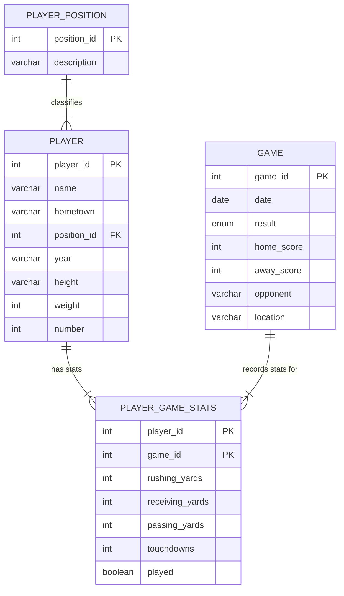
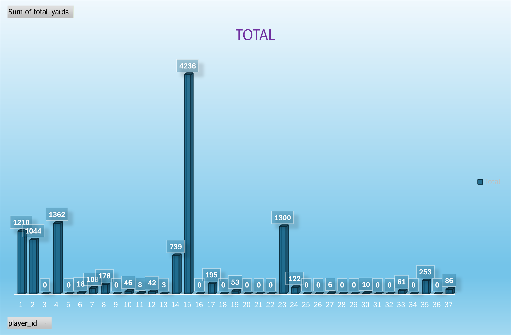

## Summary Report
#### The business/organization/person using my database
  My database is designed for a college football program that needs to efficiently store and analyze individual player performance throughout a season. This organization relies on accurate statistical tracking to evaluate athletes, prepare weekly scouting reports, and support coaching decisions. By centralizing information about game results, detailed offensive statistics, players, and their positions, the database provides the coaching staff, analysts, and support personnel with a unified and reliable system for understanding team performance.
  
  In addition to supporting coaching decisions, the database will benefit the football program's analytics and recruiting departments. Analysts can identify trends in player productivity, monitor improvements across the season, and compare similar players within position groups. Recruiters and player development staff can reference performance data to highlight player strengths during evaluations or discussions with future recruits. The system also serves as a long-term data archive, which can then be used to compare stats historically and have a deeper insight into year-by-year changes.
  
  The database can also be used by student analysts, sports management interns, and coaching assistants who are responsible for compiling post-game reports or generating weekly summaries. Due to the structure of the database being normalized, the data is consistent, clean, and easy to query. This makes it easy to simplify common tasks like calculating total offensive yards, generating top stats, or tracking season-long touchdown totals. Overall, this database provides the football program with a professional and scalable foundation for performance analysis.
#### How the database will be used from a user’s perspective
  From a user's perspective, the database functions as an organized system that allows coaches, analysts, and student staff members to quickly retrieve and update information about players and their performance. After each game, a user can enter rushing, receiving, passing, and touchdown statistics, and whether the player participated in the game into the player_game_stats table. Users can also review player information such as position, class year, and jersey number to support tasks like roster sheet creation, scouting breakdowns, and media preparation.

  Users will frequently run queries to analyze performance trends throughout the season. For example, they can view which players recorded the highest total yards in a game, compare a player's stats across multiple games, or generate summaries of team performance against specific opponents. The database also allows users to sort and filter data using meaningful categories such as position groups, game dates, or opponents. This makes it easy to answer common questions like, "Which running backs scored the most touchdowns?" or "How many yards did the offense produce in each game?"

  Additionally, the database supports more advanced reporting that the football program may rely on. Users can create views representing weekly offensive leaders, run JOIN operations to combine player and game information, and even perform updates or corrections when roster changes occur. Because the design is clean and normalized, the user does not need to worry about duplicated data or inconsistencies. They can interact with clear, well-structured tables. Overall, from the user's perspective, the database is intuitive, efficient, and tailored to the real workflow of analyzing game performance in a college football environment.

## ER Model

## Design Description
  The design of my database is fully normalized and has a relational structure that intends to store and analyze football player performance data across a full season. This database model separates the data into 4 distinct tables. We can see the basic information for each player on the team, each game in the season, and the positions on the team. Using those three tables, they can be combined to get the 4th table that describes each player's stats for every game. The tables depend solely on their primary keys, following the Third Normal Form. For example, player details such as jersey number, height, and hometown are stored only once in the player table to prevent unnecessary duplication when generating statistics for multiple games.

  A key design choice I made was creating a junction table, `player_game_stats`, to represent the many-to-many relationship between players and games. To avoid this issue, the player_game_stats table has a composite primary key of player_id and game_id. This composite key is used to uniquely identify each performance entry. The `player_game_stats` table also limited the stats to the measurable performance metrics: rushing, receiving, passing, and touchdowns, which allows game-by-game analytics without repeating player or game attributes.

  The database also normalizes player positions by storing them in a separate `player_position` table. I could have kept the full position name for each player, but I decided to create a whole table for the position. The position_id serves as a foreign key in the player table that references a single record in the player_position table. Making this choice avoids inconsistency in position naming, makes updates easier, and maintains referential integrity. Overall, the design enforces clean separation of entities while supporting flexible reporting and efficient statistical queries.
  

  ### Player
  The player table stores personal and static information for each football player, such as name, class year, hometown, physical attributes, and jersey number. It links to the player_position table through a foreign key to classify each player. Each entry represents one unique athlete in the system.
  ### Player_Position
  The player_position table defines the set of football positions, each assigned to an ID number. Storing these in a separate table prevents duplication and ensures consistency. It is referenced by the player table to assign each player exactly one position category.
  ### Game
  The game table contains information on each scheduled game, including the date, opponent, location, and final scores. It serves as the parent entity for all
  statistics recorded during that game. Each entry represents one unique matchup.
  ### Player_Game_Stats
  The player_game_stats table records all performance statistics for a single player in a single game. Because players participate in multiple games, and games include multiple players, this table resolves the many-to-many relationship between player and game tables. It includes rushing, receiving, passing yards, touchdowns, and whether the player participated in that game. A player having zero stats because they did not participate means something different than a player having zero stats while playing.
## Tables
```sql

CREATE TABLE player_position (
	position_id integer auto_increment PRIMARY KEY,
	description varChar(50)
)ENGINE=InnoDB;

CREATE TABLE player (
	player_id integer auto_increment PRIMARY KEY,
	name varChar(100),
	hometown varChar(100),
	position_id integer,
	year varChar(20),
	height varChar(10),
	weight integer,
	number integer,
	FOREIGN KEY (position_id) REFERENCES player_position(position_id)
)ENGINE=InnoDB;

CREATE TABLE game (
	game_id integer auto_increment PRIMARY KEY,
	date DATE,
	result ENUM('W', 'L'),
	home_score integer,
	away_score integer,
	opponent varChar(100),
	location varChar(100)
)ENGINE=InnoDB;


CREATE TABLE player_game_stats(
	player_id integer,
	game_id integer,
	rushing_yards integer,
	receiving_yards integer,
	passing_yards integer,
	touchdowns integer,
	played boolean,
	PRIMARY KEY (player_id, game_id),
	FOREIGN KEY (player_id) REFERENCES player(player_id),
	FOREIGN KEY (game_id) REFERENCES game(game_id)
)ENGINE=InnoDB;
```

## Data
```sql

insert into player_position (position_id, description) VALUES
(1, 'Quarterback'),
(2, 'Running Back'),
(3, 'Tight End'),
(4, 'Wide Receiver');

insert into player (player_id, name, hometown, position_id, year, height, weight, number) VALUES
(1,	'Quinshon Judkins',	'Pike Road',	2,	'Junior',	'6-0',	219,	1),
(2,	'Emeka Egbuka',	'Steilacoom',	4,	'Graduate',	'6-1',	205,	2),
(3,	'Lincoln Kienholz',	'Pierre',	1,	'Sophomore',	'6-3',	207,	3),
(4,	'Jeremiah Smith',	'Miami Gardens',	4,	'Freshman',	'6-3',	215,	4),
(5,	'Mylan Graham',	'Fort Wayne',	4,	'Freshman',	'6-1',	185,	5),
(6,	'Jayden Ballard',	'Massillon',	4,	'Senior',	'6-2',	195,	9),
(7,	'Julian Sayin',	'Carlsbad',	1,	'Freshman',	'6-1',	203,	10),
(8,	'Brandon Inniss',	'Hollywood',	4,	'Sophomore',	'6-0',	203,	11),
(9,	'Air Noland',	'College Park',	1,	'Freshman',	'6-2',	192,	12),
(10,	'Bryson Rodgers',	'Tampa',	4,	'Sophomore',	'6-2',	185,	13),
(11,	'Kojo Antwi',	'Suwanee',	4,	'Junior',	'6-0',	194,	14),
(12,	'Jelani Thurman',	'Fairburn',	3,	'Sophomore',	'6-6',	258,	15),
(13,	'Mason Maggs',	'Dublin',	1,	'Junior',	'6-2',	224,	16),
(14,	'Carnell Tate',	'Chicago',	4,	'Sophomore',	'6-3',	191,	17),
(15,	'Will Howard',	'Downington',	1,	'Graduate',	'6-4',	235,	18),
(16,	'Chad Ray',	'Dublin',	1,	'Senior',	'6-2',	215,	19),
(17,	'James People',	'San Antonio',	2,	'Freshman',	'5-10',	203,	20),
(18,	'Nolan Baudo',	'Chicago',	4,	'Sophomore',	'5-10',	180,	23),
(19,	'Sam Dixon',	'Pickerington',	2,	'Freshman',	'5-11',	203,	24),
(20,	'Chase Brecht',	'Powell',	2,	'Junior',	'6-0',	205,	26),
(21,	'TC Caffey',	'Hubbard',	2,	'Junior',	'5-10',	215,	28),
(22,	'Rashid SeSay',	'Zanesville',	2,	'Freshman',	'5-11',	190,	30),
(23,	'TreVeyon Henderson',	'Hopewell',	2,	'Senior',	'5-10',	208,	32),
(24,	'Devin Brown',	'Gilbert',	1,	'Junior',	'6-3',	212,	33),
(25,	'Brennen Schramm',	'Medina',	4,	'Sophomore',	'6-0',	191,	34),
(26,	'Jace Middleton',	'Lewis Center',	3,	'Senior',	'6-4',	235,	46),
(27,	'Patrick Gurd',	'New Albany',	3,	'Senior',	'6-4',	249,	49),
(28,	'Shawn Lodge',	'Akron',	4,	'Junior',	'6-0',	170,	80),
(29,	'Damarion Witten',	'Cleveland',	4,	'Freshman',	'6-4',	215,	81),
(30,	'David Adolph',	'Dublin',	4,	'Junior',	'6-5',	209,	82),
(31,	'Joop Mitchell',	'Wyoming',	4,	'Senior',	'6-1',	180,	83),
(32,	'Dorian Williams',	'Cincinnati',	4,	'Freshman',	'6-2',	200,	84),
(33,	'Bennett Christian',	'Acworth',	3,	'Junior',	'6-6',	260,	85),
(34,	'Maxence LeBlanc',	'St-Bruno',	3,	'Freshman',	'6-4',	227,	86),
(35,	'Gee Scott Jr.',	'Seattle',	3,	'Graduate',	'6-3',	243,	88),
(36,	'Zak Herbstreit',	'Nashville',	3,	'Senior',	'6-2',	240,	89),
(37,	'Will Kacmarek',	'St. Louis',	3,	'Senior',	'6-6',	260,	89);

insert into game(game_id, date, result, home_score, away_score, opponent, location) VALUES
(1,	'2024-8-31',	'W',	52,	6,	'Akron',	'Ohio State'),
(2,	'2024-9-7',	'W',	56,	0,	'Western Michigan',	'Ohio State'),
(3,	'2024-9-21',	'W',	49,	14,	'Marshall',	'Ohio State'),
(4,	'2024-9-28',	'W',	7,	38,	'Michigan State',	'Michigan State'),
(5,	'2024-10-5',	'W',	35,	7,	'Iowa',	'Ohio State'),
(6,	'2024-10-12',	'L',	32,	31,	'Oregon',	'Oregon'),
(7,	'2024-10-26',	'W',	21,	17,	'Nebraska',	'Ohio State'),
(8,	'2024-11-2',	'W',	13,	20,	'Penn State',	'Penn State'),
(9,	'2024-11-9',	'W',	45,	0,	'Purdue',	'Ohio State'),
(10,	'2024-11-16',	'W',	7,	31,	'Northwestern',	'Northwestern'),
(11,	'2024-11-23',	'W',	38,	15,	'Indiana',	'Ohio State'),
(12,	'2024-11-30',	'L',	10,	13,	'Michigan',	'Ohio State'),
(13,	'2024-12-21',	'W',	42,	17,	'Tennessee',	'Ohio State'),
(14,	'2025-1-1',	'W',	21,	41,	'Oregon',	'Rose Bowl'),
(15,	'2025-1-10',	'W',	14,	28,	'Texas',	'Cotton Bowl'),
(16,	'2025-1-20',	'W',	23,	34,	'Notre Dame',	'National Championship');

insert into player_game_stats(player_id, game_id, rushing_yards, receiving_yards, passing_yards, touchdowns, played) VALUES
(1,	1,	55,	0,	0,	1,	1),
(2,	1,	0,	51,	0,	0,	1),
(3,	1,	0,	0,	0,	0,	0),
(4,	1,	0,	92,	0,	2,	1),
(5,	1,	0,	0,	0,	0,	0),
(6,	1,	0,	6,	0,	0,	1),
(7,	1,	0,	0,	0,	0,	0),
(8,	1,	0,	0,	0,	0,	1),
(9,	1,	0,	0,	0,	0,	0),
(10,	1,	0,	9,	0,	0,	1),
(11,	1,	0,	0,	0,	0,	1),
(12,	1,	0,	0,	0,	0,	1),
(13,	1,	0,	0,	0,	0,	0),
(14,	1,	0,	58,	0,	1,	1),
(15,	1,	18,	0,	228,	4,	1),
(16,	1,	0,	0,	0,	0,	0),
(17,	1,	30,	0,	0,	1,	1),
(18,	1,	0,	0,	0,	0,	0),
(19,	1,	4,	0,	0,	0,	1),
(20,	1,	0,	0,	0,	0,	0),
(21,	1,	0,	0,	0,	0,	0),
(22,	1,	0,	0,	0,	0,	0),
(23,	1,	65,	18,	0,	0,	1),
(24,	1,	0,	0,	6,	0,	1),
(25,	1,	0,	0,	0,	0,	0),
(26,	1,	0,	0,	0,	0,	0),
(27,	1,	0,	0,	0,	0,	1),
(28,	1,	0,	0,	0,	0,	0),
(29,	1,	0,	0,	0,	0,	0),
(30,	1,	0,	0,	0,	0,	1),
(31,	1,	0,	0,	0,	0,	0),
(32,	1,	0,	0,	0,	0,	0),
(33,	1,	0,	0,	0,	0,	1),
(34,	1,	0,	0,	0,	0,	0),
(35,	1,	0,	0,	0,	0,	1),
(36,	1,	0,	0,	0,	0,	0),
(37,	1,	0,	0,	0,	0,	1),
(1,	2,	108,	0,	0,	2,	1),
(2,	2,	0,	98,	0,	0,	1),
(3,	2,	0,	0,	0,	0,	1),
(4,	2,	0,	119,	0,	1,	1),
(5,	2,	0,	0,	0,	0,	1),
(6,	2,	0,	12,	0,	0,	1),
(7,	2,	5,	0,	61,	1,	1),
(8,	2,	0,	45,	0,	0,	1),
(9,	2,	0,	0,	0,	0,	0),
(10,	2,	0,	12,	0,	0,	1),
(11,	2,	0,	8,	0,	0,	1),
(12,	2,	0,	0,	0,	0,	1),
(13,	2,	3,	0,	0,	0,	1),
(14,	2,	0,	45,	0,	0,	1),
(15,	2,	6,	0,	292,	2,	1),
(16,	2,	0,	0,	0,	0,	0),
(17,	2,	51,	-2,	0,	1,	1),
(18,	2,	0,	0,	0,	0,	0),
(19,	2,	40,	0,	0,	0,	1),
(20,	2,	0,	0,	0,	0,	0),
(21,	2,	0,	0,	0,	0,	0),
(22,	2,	0,	0,	0,	0,	0),
(23,	2,	66,	0,	0,	2,	1),
(24,	2,	-8,	0,	57,	0,	1),
(25,	2,	0,	0,	0,	0,	0),
(26,	2,	0,	0,	0,	0,	0),
(27,	2,	0,	6,	0,	0,	1),
(28,	2,	0,	0,	0,	0,	0),
(29,	2,	0,	0,	0,	0,	0),
(30,	2,	0,	0,	0,	0,	1),
(31,	2,	0,	0,	0,	0,	1),
(32,	2,	0,	0,	0,	0,	0),
(33,	2,	0,	55,	0,	1,	1),
(34,	2,	0,	0,	0,	0,	0),
(35,	2,	0,	5,	0,	0,	1),
(36,	2,	0,	0,	0,	0,	0),
(37,	2,	0,	7,	0,	0,	1),
(1,	3,	173,	14,	0,	2,	1),
(2,	3,	0,	117,	0,	1,	1),
(3,	3,	0,	0,	0,	0,	0),
(4,	3,	0,	70,	0,	1,	1),
(5,	3,	0,	0,	0,	0,	0),
(6,	3,	0,	0,	0,	0,	1),
(7,	3,	0,	0,	0,	0,	0),
(8,	3,	0,	4,	0,	0,	1),
(9,	3,	0,	0,	0,	0,	0),
(10,	3,	0,	0,	0,	0,	1),
(11,	3,	0,	0,	0,	0,	1),
(12,	3,	0,	3,	0,	0,	1),
(13,	3,	0,	0,	0,	0,	0),
(14,	3,	0,	64,	0,	1,	1),
(15,	3,	-2,	0,	275,	3,	1),
(16,	3,	0,	0,	0,	0,	0),
(17,	3,	31,	0,	0,	0,	1),
(18,	3,	0,	0,	0,	0,	0),
(19,	3,	0,	0,	0,	0,	0),
(20,	3,	0,	0,	0,	0,	0),
(21,	3,	0,	0,	0,	0,	0),
(22,	3,	0,	0,	0,	0,	0),
(23,	3,	76,	0,	0,	2,	1),
(24,	3,	3,	0,	14,	0,	1),
(25,	3,	0,	0,	0,	0,	0),
(26,	3,	0,	0,	0,	0,	0),
(27,	3,	0,	0,	0,	0,	1),
(28,	3,	0,	0,	0,	0,	0),
(29,	3,	0,	0,	0,	0,	0),
(30,	3,	0,	10,	0,	0,	1),
(31,	3,	0,	0,	0,	0,	0),
(32,	3,	0,	0,	0,	0,	0),
(33,	3,	0,	0,	0,	0,	1),
(34,	3,	0,	0,	0,	0,	0),
(35,	3,	0,	0,	0,	0,	1),
(36,	3,	0,	0,	0,	0,	0),
(37,	3,	0,	7,	0,	0,	1),
(1,	4,	54,	17,	0,	0,	1),
(2,	4,	0,	96,	0,	1,	1),
(3,	4,	0,	0,	0,	0,	0),
(4,	4,	19,	83,	0,	2,	1),
(5,	4,	0,	0,	0,	0,	0),
(6,	4,	0,	0,	0,	0,	0),
(7,	4,	0,	0,	23,	0,	1),
(8,	4,	0,	14,	0,	0,	1),
(9,	4,	0,	0,	0,	0,	0),
(10,	4,	0,	17,	0,	0,	1),
(11,	4,	0,	0,	0,	0,	0),
(12,	4,	0,	0,	0,	0,	0),
(13,	4,	0,	0,	0,	0,	0),
(14,	4,	0,	52,	0,	0,	1),
(15,	4,	14,	0,	244,	3,	1),
(16,	4,	0,	0,	0,	0,	0),
(17,	4,	29,	0,	0,	0,	1),
(18,	4,	0,	0,	0,	0,	0),
(19,	4,	0,	0,	0,	0,	0),
(20,	4,	0,	0,	0,	0,	0),
(21,	4,	0,	0,	0,	0,	0),
(22,	4,	0,	0,	0,	0,	0),
(23,	4,	69,	-1,	0,	0,	1),
(24,	4,	0,	0,	31,	0,	1),
(25,	4,	0,	0,	0,	0,	0),
(26,	4,	0,	0,	0,	0,	0),
(27,	4,	0,	0,	0,	0,	1),
(28,	4,	0,	0,	0,	0,	0),
(29,	4,	0,	0,	0,	0,	0),
(30,	4,	0,	0,	0,	0,	1),
(31,	4,	0,	0,	0,	0,	0),
(32,	4,	0,	0,	0,	0,	0),
(33,	4,	0,	6,	0,	0,	1),
(34,	4,	0,	0,	0,	0,	0),
(35,	4,	0,	14,	0,	1,	1),
(36,	4,	0,	0,	0,	0,	0),
(37,	4,	0,	0,	0,	0,	1),
(1,	5,	78,	-2,	0,	0,	1),
(2,	5,	0,	71,	0,	3,	1),
(3,	5,	0,	0,	0,	0,	0),
(4,	5,	14,	89,	0,	1,	1),
(5,	5,	0,	0,	0,	0,	0),
(6,	5,	0,	0,	0,	0,	1),
(7,	5,	0,	0,	0,	0,	0),
(8,	5,	0,	29,	0,	0,	1),
(9,	5,	0,	0,	0,	0,	0),
(10,	5,	0,	8,	0,	0,	1),
(11,	5,	0,	0,	0,	0,	1),
(12,	5,	0,	0,	0,	0,	1),
(13,	5,	0,	0,	0,	0,	0),
(14,	5,	0,	0,	0,	0,	0),
(15,	5,	28,	0,	209,	5,	1),
(16,	5,	0,	0,	0,	0,	0),
(17,	5,	12,	0,	0,	0,	1),
(18,	5,	0,	0,	0,	0,	0),
(19,	5,	0,	0,	0,	0,	0),
(20,	5,	0,	0,	0,	0,	0),
(21,	5,	0,	0,	0,	0,	0),
(22,	5,	0,	0,	0,	0,	0),
(23,	5,	61,	2,	0,	0,	1),
(24,	5,	10,	0,	0,	0,	1),
(25,	5,	0,	0,	0,	0,	0),
(26,	5,	0,	0,	0,	0,	0),
(27,	5,	0,	0,	0,	0,	1),
(28,	5,	0,	0,	0,	0,	0),
(29,	5,	0,	0,	0,	0,	0),
(30,	5,	0,	0,	0,	0,	1),
(31,	5,	0,	0,	0,	0,	0),
(32,	5,	0,	0,	0,	0,	0),
(33,	5,	0,	0,	0,	0,	1),
(34,	5,	0,	0,	0,	0,	0),
(35,	5,	0,	0,	0,	0,	1),
(36,	5,	0,	0,	0,	0,	0),
(37,	5,	0,	12,	0,	0,	1),
(1,	6,	12,	38,	0,	1,	1),
(2,	6,	20,	93,	0,	1,	1),
(3,	6,	0,	0,	0,	0,	0),
(4,	6,	0,	100,	0,	1,	1),
(5,	6,	0,	0,	0,	0,	0),
(6,	6,	0,	0,	0,	0,	0),
(7,	6,	0,	0,	0,	0,	0),
(8,	6,	0,	0,	0,	0,	1),
(9,	6,	0,	0,	0,	0,	0),
(10,	6,	0,	0,	0,	0,	1),
(11,	6,	0,	0,	0,	0,	0),
(12,	6,	0,	0,	0,	0,	1),
(13,	6,	0,	0,	0,	0,	0),
(14,	6,	0,	13,	0,	0,	1),
(15,	6,	13, 0,	326,	3,	1),
(16,	6,	0,	0,	0,	0,	0),
(17,	6,	0,	0,	0,	0,	0),
(18,	6,	0,	0,	0,	0,	0),
(19,	6,	0,	0,	0,	0,	0),
(20,	6,	0,	0,	0,	0,	0),
(21,	6,	0,	0,	0,	0,	0),
(22,	6,	0,	0,	0,	0,	0),
(23,	6,	87,	4,	0,	0,	1),
(24,	6,	0,	0,	0,	0,	0),
(25,	6,	0,	0,	0,	0,	0),
(26,	6,	0,	0,	0,	0,	0),
(27,	6,	0,	0,	0,	0,	1),
(28,	6,	0,	0,	0,	0,	0),
(29,	6,	0,	0,	0,	0,	0),
(30,	6,	0,	0,	0,	0,	0),
(31,	6,	0,	0,	0,	0,	0),
(32,	6,	0,	0,	0,	0,	0),
(33,	6,	0,	0,	0,	0,	1),
(34,	6,	0,	0,	0,	0,	0),
(35,	6,	0,	46,	0,	0,	1),
(36,	6,	0,	0,	0,	0,	0),
(37,	6,	0,	32,	0,	0,	1),
(1,	7,	29,	9,	0,	1,	1),
(2,	7,	0,	20,	0,	0,	1),
(3,	7,	0,	0,	0,	0,	0),
(4,	7,	0,	70,	0,	1,	1),
(5,	7,	0,	0,	0,	0,	0),
(6,	7,	0,	0,	0,	0,	0),
(7,	7,	0,	0,	0,	0,	0),
(8,	7,	0,	0,	0,	0,	1),
(9,	7,	0,	0,	0,	0,	0),
(10,	7,	0,	0,	0,	0,	1),
(11,	7,	0,	0,	0,	0,	1),
(12,	7,	0,	0,	0,	0,	1),
(13,	7,	0,	0,	0,	0,	0),
(14,	7,	0,	102,	0,	1,	1),
(15,	7,	14,	0,	221,	3,	1),
(16,	7,	0,	0,	0,	0,	0),
(17,	7,	0,	0,	0,	0,	0),
(18,	7,	0,	0,	0,	0,	0),
(19,	7,	0,	0,	0,	0,	0),
(20,	7,	0,	0,	0,	0,	0),
(21,	7,	0,	0,	0,	0,	1),
(22,	7,	0,	0,	0,	0,	0),
(23,	7,	25,	0,	0,	0,	1),
(24,	7,	0,	0,	0,	0,	0),
(25,	7,	0,	0,	0,	0,	0),
(26,	7,	0,	0,	0,	0,	0),
(27,	7,	0,	0,	0,	0,	1),
(28,	7,	0,	0,	0,	0,	0),
(29,	7,	0,	0,	0,	0,	0),
(30,	7,	0,	0,	0,	0,	1),
(31,	7,	0,	0,	0,	0,	0),
(32,	7,	0,	0,	0,	0,	0),
(33,	7,	0,	0,	0,	0,	1),
(34,	7,	0,	0,	0,	0,	0),
(35,	7,	0,	20,	0,	0,	1),
(36,	7,	0,	0,	0,	0,	0),
(37,	7,	0,	0,	0,	0,	0),
(1,	8,	95,	5,	0,	0,	1),
(2,	8,	6,	31,	0,	1,	1),
(3,	8,	0,	0,	0,	0,	0),
(4,	8,	0,	55,	0,	0,	1),
(5,	8,	0,	0,	0,	0,	0),
(6,	8,	0,	0,	0,	0,	0),
(7,	8,	0,	0,	0,	0,	0),
(8,	8,	0,	33,	0,	1,	1),
(9,	8,	0,	0,	0,	0,	0),
(10,	8,	0,	0,	0,	0,	1),
(11,	8,	0,	0,	0,	0,	0),
(12,	8,	0,	19,	0,	0,	1),
(13,	8,	0,	0,	0,	0,	0),
(14,	8,	0,	15,	0,	0,	1),
(15,	8,	24,	0,	182,	2,	1),
(16,	8,	0,	0,	0,	0,	0),
(17,	8,	0,	0,	0,	0,	0),
(18,	8,	0,	0,	0,	0,	0),
(19,	8,	0,	0,	0,	0,	0),
(20,	8,	0,	0,	0,	0,	0),
(21,	8,	0,	0,	0,	0,	0),
(22,	8,	0,	0,	0,	0,	0),
(23,	8,	54,	20,	0,	0,	1),
(24,	8,	0,	0,	0,	0,	0),
(25,	8,	0,	0,	0,	0,	0),
(26,	8,	0,	0,	0,	0,	0),
(27,	8,	0,	0,	0,	0,	0),
(28,	8,	0,	0,	0,	0,	0),
(29,	8,	0,	0,	0,	0,	0),
(30,	8,	0,	0,	0,	0,	1),
(31,	8,	0,	0,	0,	0,	0),
(32,	8,	0,	0,	0,	0,	0),
(33,	8,	0,	0,	0,	0,	0),
(34,	8,	0,	0,	0,	0,	0),
(35,	8,	0,	4,	0,	0,	1),
(36,	8,	0,	0,	0,	0,	0),
(37,	8,	0,	0,	0,	0,	0),
(1,	9,	32,	13,	0,	0,	1),
(2,	9,	0,	10,	0,	1,	1),
(3,	9,	0,	0,	0,	0,	0),
(4,	9,	0,	87,	0,	1,	1),
(5,	9,	0,	0,	0,	0,	1),
(6,	9,	0,	0,	0,	0,	0),
(7,	9,	19,	0,	0,	0,	1),
(8,	9,	0,	17,	0,	0,	1),
(9,	9,	0,	0,	0,	0,	0),
(10,	9,	0,	0,	0,	0,	1),
(11,	9,	0,	0,	0,	0,	0),
(12,	9,	0,	19,	0,	0,	1),
(13,	9,	0,	0,	0,	0,	0),
(14,	9,	6,	56,	0,	0,	1),
(15,	9,	7,	0,	260,	4,	1),
(16,	9,	0,	0,	0,	0,	0),
(17,	9,	12,	0,	0,	0,	1),
(18,	9,	0,	0,	0,	0,	0),
(19,	9,	9,	0,	0,	0,	1),
(20,	9,	0,	0,	0,	0,	0),
(21,	9,	0,	0,	0,	0,	0),
(22,	9,	0,	0,	0,	0,	0),
(23,	9,	85,	43,	0,	1,	1),
(24,	9,	3,	0,	0,	0,	1),
(25,	9,	0,	0,	0,	0,	1),
(26,	9,	0,	0,	0,	0,	0),
(27,	9,	0,	0,	0,	0,	1),
(28,	9,	0,	0,	0,	0,	0),
(29,	9,	0,	0,	0,	0,	1),
(30,	9,	0,	0,	0,	0,	1),
(31,	9,	0,	0,	0,	0,	0),
(32,	9,	0,	0,	0,	0,	0),
(33,	9,	0,	0,	0,	0,	1),
(34,	9,	0,	0,	0,	0,	1),
(35,	9,	0,	15,	0,	1,	1),
(36,	9,	0,	0,	0,	0,	0),
(37,	9,	0,	0,	0,	0,	0),
(1,	10,	76,	8,	0,	2,	1),
(2,	10,	-5,	25,	0,	0,	1),
(3,	10,	0,	0,	0,	0,	0),
(4,	10,	2,	100,	0,	0,	1),
(5,	10,	0,	0,	0,	0,	0),
(6,	10,	0,	0,	0,	0,	1),
(7,	10,	0,	0,	0,	0,	0),
(8,	10,	0,	9,	0,	0,	1),
(9,	10,	0,	0,	0,	0,	0),
(10,	10,	0,	0,	0,	0,	1),
(11,	10,	0,	0,	0,	0,	0),
(12,	10,	0,	0,	0,	0,	1),
(13,	10,	0,	0,	0,	0,	0),
(14,	10,	0,	52,	0,	2,	1),
(15,	10,	0,	0,	247,	2,	1),
(16,	10,	0,	0,	0,	0,	0),
(17,	10,	26,	0,	0,	0,	1),
(18,	10,	0,	0,	0,	0,	0),
(19,	10,	0,	0,	0,	0,	0),
(20,	10,	0,	0,	0,	0,	0),
(21,	10,	0,	0,	0,	0,	0),
(22,	10,	0,	0,	0,	0,	0),
(23,	10,	74,	19,	0,	0,	1),
(24,	10,	0,	0,	0,	0,	1),
(25,	10,	0,	0,	0,	0,	0),
(26,	10,	0,	0,	0,	0,	0),
(27,	10,	0,	0,	0,	0,	1),
(28,	10,	0,	0,	0,	0,	0),
(29,	10,	0,	0,	0,	0,	0),
(30,	10,	0,	0,	0,	0,	1),
(31,	10,	0,	0,	0,	0,	0),
(32,	10,	0,	0,	0,	0,	0),
(33,	10,	0,	0,	0,	0,	1),
(34,	10,	0,	0,	0,	0,	1),
(35,	10,	0,	34,	0,	0,	1),
(36,	10,	0,	0,	0,	0,	0),
(37,	10,	0,	0,	0,	0,	0),
(1,	11,	36,	7,	0,	0,	1),
(2,	11,	0,	80,	0,	1,	1),
(3,	11,	0,	0,	0,	0,	0),
(4,	11,	12,	34,	0,	0,	1),
(5,	11,	0,	0,	0,	0,	0),
(6,	11,	0,	0,	0,	0,	0),
(7,	11,	0,	0,	0,	0,	0),
(8,	11,	0,	0,	0,	0,	1),
(9,	11,	0,	0,	0,	0,	0),
(10,	11,	0,	0,	0,	0,	0),
(11,	11,	0,	0,	0,	0,	0),
(12,	11,	0,	1,	0,	1,	1),
(13,	11,	0,	0,	0,	0,	0),
(14,	11,	0,	68,	0,	0,	1),
(15,	11,	-1,	0,	201,	2,	1),
(16,	11,	0,	0,	0,	0,	0),
(17,	11,	0,	0,	0,	0,	0),
(18,	11,	0,	0,	0,	0,	0),
(19,	11,	0,	0,	0,	0,	0),
(20,	11,	0,	0,	0,	0,	0),
(21,	11,	0,	0,	0,	0,	0),
(22,	11,	0,	0,	0,	0,	0),
(23,	11,	68,	5,	0,	1,	1),
(24,	11,	0,	0,	0,	0,	0),
(25,	11,	0,	0,	0,	0,	0),
(26,	11,	0,	0,	0,	0,	0),
(27,	11,	0,	0,	0,	0,	1),
(28,	11,	0,	0,	0,	0,	0),
(29,	11,	0,	0,	0,	0,	0),
(30,	11,	0,	0,	0,	0,	1),
(31,	11,	0,	0,	0,	0,	0),
(32,	11,	0,	0,	0,	0,	0),
(33,	11,	0,	0,	0,	0,	0),
(34,	11,	0,	0,	0,	0,	0),
(35,	11,	0,	6,	0,	0,	1),
(36,	11,	0,	0,	0,	0,	0),
(37,	11,	0,	0,	0,	0,	1),
(1,	12,	46,	0,	0,	0,	1),
(2,	12,	0,	51,	0,	0,	1),
(3,	12,	0,	0,	0,	0,	0),
(4,	12,	0,	35,	0,	1,	1),
(5,	12,	0,	0,	0,	0,	0),
(6,	12,	0,	0,	0,	0,	1),
(7,	12,	0,	0,	0,	0,	0),
(8,	12,	0,	0,	0,	0,	1),
(9,	12,	0,	0,	0,	0,	0),
(10,	12,	0,	0,	0,	0,	0),
(11,	12,	0,	0,	0,	0,	0),
(12,	12,	0,	0,	0,	0,	1),
(13,	12,	0,	0,	0,	0,	0),
(14,	12,	0,	58,	0,	0,	1),
(15,	12,	10,	0,	175,	1,	1),
(16,	12,	0,	0,	0,	0,	0),
(17,	12,	0,	0,	0,	0,	0),
(18,	12,	0,	0,	0,	0,	0),
(19,	12,	0,	0,	0,	0,	0),
(20,	12,	0,	0,	0,	0,	0),
(21,	12,	0,	0,	0,	0,	0),
(22,	12,	0,	0,	0,	0,	0),
(23,	12,	21,	25,	0,	0,	1),
(24,	12,	0,	0,	0,	0,	1),
(25,	12,	0,	0,	0,	0,	0),
(26,	12,	0,	0,	0,	0,	0),
(27,	12,	0,	0,	0,	0,	1),
(28,	12,	0,	0,	0,	0,	0),
(29,	12,	0,	0,	0,	0,	0),
(30,	12,	0,	0,	0,	0,	1),
(31,	12,	0,	0,	0,	0,	0),
(32,	12,	0,	0,	0,	0,	0),
(33,	12,	0,	0,	0,	0,	1),
(34,	12,	0,	0,	0,	0,	0),
(35,	12,	0,	6,	0,	0,	1),
(36,	12,	0,	0,	0,	0,	0),
(37,	12,	0,	0,	0,	0,	0),
(1,	13,	34,	9,	0,	2,	1),
(2,	13,	-1,	81,	0,	0,	1),
(3,	13,	0,	0,	0,	0,	1),
(4,	13,	0,	103,	0,	2,	1),
(5,	13,	0,	0,	0,	0,	1),
(6,	13,	0,	0,	0,	0,	0),
(7,	13,	0,	0,	0,	0,	1),
(8,	13,	0,	6,	0,	0,	1),
(9,	13,	0,	0,	0,	0,	0),
(10,	13,	0,	0,	0,	0,	1),
(11,	13,	0,	0,	0,	0,	0),
(12,	13,	0,	0,	0,	0,	1),
(13,	13,	0,	0,	0,	0,	0),
(14,	13,	0,	18,	0,	0,	1),
(15,	13,	37,	0,	311,	2,	1),
(16,	13,	0,	0,	0,	0,	0),
(17,	13,	6,	0,	0,	0,	1),
(18,	13,	0,	0,	0,	0,	0),
(19,	13,	0,	0,	0,	0,	0),
(20,	13,	0,	0,	0,	0,	0),
(21,	13,	0,	0,	0,	0,	0),
(22,	13,	0,	0,	0,	0,	0),
(23,	13,	80,	54,	0,	2,	1),
(24,	13,	0,	0,	6,	0,	1),
(25,	13,	0,	0,	0,	0,	0),
(26,	13,	0,	0,	0,	0,	0),
(27,	13,	0,	0,	0,	0,	1),
(28,	13,	0,	0,	0,	0,	0),
(29,	13,	0,	0,	0,	0,	0),
(30,	13,	0,	0,	0,	0,	1),
(31,	13,	0,	0,	0,	0,	0),
(32,	13,	0,	0,	0,	0,	0),
(33,	13,	0,	0,	0,	0,	0),
(34,	13,	0,	0,	0,	0,	1),
(35,	13,	0,	39,	0,	0,	1),
(36,	13,	0,	0,	0,	0,	0),
(37,	13,	0,	7,	0,	0,	1),
(1,	14,	85,	0,	0,	0,	1),
(2,	14,	0,	72,	0,	1,	0),
(3,	14,	0,	0,	0,	0,	0),
(4,	14,	5,	187,	0,	2,	1),
(5,	14,	0,	0,	0,	0,	1),
(6,	14,	0,	0,	0,	0,	0),
(7,	14,	0,	0,	0,	0,	0),
(8,	14,	0,	0,	0,	0,	1),
(9,	14,	0,	0,	0,	0,	0),
(10,	14,	0,	0,	0,	0,	1),
(11,	14,	0,	0,	0,	0,	0),
(12,	14,	0,	0,	0,	0,	1),
(13,	14,	0,	0,	0,	0,	0),
(14,	14,	0,	10,	0,	0,	1),
(15,	14,	-3,	0,	319,	3,	1),
(16,	14,	0,	0,	0,	0,	0),
(17,	14,	0,	0,	0,	0,	0),
(18,	14,	0,	0,	0,	0,	0),
(19,	14,	0,	0,	0,	0,	0),
(20,	14,	0,	0,	0,	0,	0),
(21,	14,	0,	0,	0,	0,	0),
(22,	14,	0,	0,	0,	0,	0),
(23,	14,	94,	20,	0,	2,	1),
(24,	14,	0,	0,	0,	0,	0),
(25,	14,	0,	0,	0,	0,	0),
(26,	14,	0,	0,	0,	0,	0),
(27,	14,	0,	0,	0,	0,	1),
(28,	14,	0,	0,	0,	0,	0),
(29,	14,	0,	0,	0,	0,	0),
(30,	14,	0,	0,	0,	0,	1),
(31,	14,	0,	0,	0,	0,	0),
(32,	14,	0,	0,	0,	0,	0),
(33,	14,	0,	0,	0,	0,	1),
(34,	14,	0,	0,	0,	0,	0),
(35,	14,	0,	30,	0,	0,	1),
(36,	14,	0,	0,	0,	0,	0),
(37,	14,	0,	0,	0,	0,	0),
(1,	15,	36,	22,	0,	2,	1),
(2,	15,	0,	51,	0,	0,	1),
(3,	15,	0,	0,	0,	0,	0),
(4,	15,	0,	3,	0,	0,	1),
(5,	15,	0,	0,	0,	0,	0),
(6,	15,	0,	0,	0,	0,	0),
(7,	15,	0,	0,	0,	0,	0),
(8,	15,	0,	0,	0,	0,	1),
(9,	15,	0,	0,	0,	0,	0),
(10,	15,	0,	0,	0,	0,	0),
(11,	15,	0,	0,	0,	0,	0),
(12,	15,	0,	0,	0,	0,	0),
(13,	15,	0,	0,	0,	0,	0),
(14,	15,	0,	87,	0,	0,	1),
(15,	15,	4,	0,	289,	1,	1),
(16,	15,	0,	0,	0,	0,	0),
(17,	15,	0,	0,	0,	0,	0),
(18,	15,	0,	0,	0,	0,	0),
(19,	15,	0,	0,	0,	0,	0),
(20,	15,	0,	0,	0,	0,	0),
(21,	15,	0,	0,	0,	0,	0),
(22,	15,	0,	0,	0,	0,	0),
(23,	15,	42,	75,	0,	1,	1),
(24,	15,	0,	0,	0,	0,	0),
(25,	15,	0,	0,	0,	0,	0),
(26,	15,	0,	0,	0,	0,	0),
(27,	15,	0,	0,	0,	0,	0),
(28,	15,	0,	0,	0,	0,	0),
(29,	15,	0,	0,	0,	0,	0),
(30,	15,	0,	0,	0,	0,	1),
(31,	15,	0,	0,	0,	0,	0),
(32,	15,	0,	0,	0,	0,	0),
(33,	15,	0,	0,	0,	0,	1),
(34,	15,	0,	0,	0,	0,	0),
(35,	15,	0,	30,	0,	0,	1),
(36,	15,	0,	0,	0,	0,	0),
(37,	15,	0,	21,	0,	0,	1),
(1,	16,	100,	21,	0,	3,	1),
(2,	16,	13,	64,	0,	0,	1),
(3,	16,	0,	0,	0,	0,	0),
(4,	16,	-5,	88,	0,	1,	1),
(5,	16,	0,	0,	0,	0,	0),
(6,	16,	0,	0,	0,	0,	0),
(7,	16,	0,	0,	0,	0,	0),
(8,	16,	0,	19,	0,	0,	1),
(9,	16,	0,	0,	0,	0,	0),
(10,	16,	0,	0,	0,	0,	0),
(11,	16,	0,	0,	0,	0,	0),
(12,	16,	0,	0,	0,	0,	1),
(13,	16,	0,	0,	0,	0,	0),
(14,	16,	0,	35,	0,	0,	0),
(15,	16,	57,	0,	231,	2,	1),
(16,	16,	0,	0,	0,	0,	0),
(17,	16,	0,	0,	0,	0,	0),
(18,	16,	0,	0,	0,	0,	0),
(19,	16,	0,	0,	0,	0,	1),
(20,	16,	0,	0,	0,	0,	0),
(21,	16,	0,	0,	0,	0,	0),
(22,	16,	0,	0,	0,	0,	0),
(23,	16,	49,	0,	0,	0,	1),
(24,	16,	0,	0,	0,	0,	0),
(25,	16,	0,	0,	0,	0,	0),
(26,	16,	0,	0,	0,	0,	0),
(27,	16,	0,	0,	0,	0,	1),
(28,	16,	0,	0,	0,	0,	0),
(29,	16,	0,	0,	0,	0,	0),
(30,	16,	0,	0,	0,	0,	1),
(31,	16,	0,	0,	0,	0,	0),
(32,	16,	0,	0,	0,	0,	0),
(33,	16,	0,	0,	0,	0,	1),
(34,	16,	0,	0,	0,	0,	0),
(35,	16,	0,	4,	0,	0,	1),
(36,	16,	0,	0,	0,	0,	0),
(37,	16,	0,	0,	0,	0,	1);
```

## Queries
### Query #1

This query lists all the information by `position_id` ascending, and then by full `name` in alphabetical order. This can be helpful when checking that all players are in the roster.

```sql
SELECT * FROM player
ORDER BY position_id ASC, name ASC;
```
```sql
+-----------+--------------------+---------------+-------------+-----------+--------+--------+--------+
| player_id | name               | hometown      | position_id | year      | height | weight | number |
+-----------+--------------------+---------------+-------------+-----------+--------+--------+--------+
|         9 | Air Noland         | College Park  |           1 | Freshman  | 6-2    |    192 |     12 |
|        16 | Chad Ray           | Dublin        |           1 | Senior    | 6-2    |    215 |     19 |
|        24 | Devin Brown        | Gilbert       |           1 | Junior    | 6-3    |    212 |     33 |
|         7 | Julian Sayin       | Carlsbad      |           1 | Freshman  | 6-1    |    203 |     10 |
|         3 | Lincoln Kienholz   | Pierre        |           1 | Sophomore | 6-3    |    207 |      3 |
|        13 | Mason Maggs        | Dublin        |           1 | Junior    | 6-2    |    224 |     16 |
|        15 | Will Howard        | Downington    |           1 | Graduate  | 6-4    |    235 |     18 |
|        20 | Chase Brecht       | Powell        |           2 | Junior    | 6-0    |    205 |     26 |
|        17 | James People       | San Antonio   |           2 | Freshman  | 5-10   |    203 |     20 |
|         1 | Quinshon Judkins   | Pike Road     |           2 | Junior    | 6-0    |    219 |      1 |
|        22 | Rashid SeSay       | Zanesville    |           2 | Freshman  | 5-11   |    190 |     30 |
|        19 | Sam Dixon          | Pickerington  |           2 | Freshman  | 5-11   |    203 |     24 |
|        21 | TC Caffey          | Hubbard       |           2 | Junior    | 5-10   |    215 |     28 |
|        23 | TreVeyon Henderson | Hopewell      |           2 | Senior    | 5-10   |    208 |     32 |
|        33 | Bennett Christian  | Acworth       |           3 | Junior    | 6-6    |    260 |     85 |
|        35 | Gee Scott Jr.      | Seattle       |           3 | Graduate  | 6-3    |    243 |     88 |
|        26 | Jace Middleton     | Lewis Center  |           3 | Senior    | 6-4    |    235 |     46 |
|        12 | Jelani Thurman     | Fairburn      |           3 | Sophomore | 6-6    |    258 |     15 |
|        34 | Maxence LeBlanc    | St-Bruno      |           3 | Freshman  | 6-4    |    227 |     86 |
|        27 | Patrick Gurd       | New Albany    |           3 | Senior    | 6-4    |    249 |     49 |
|        37 | Will Kacmarek      | St. Louis     |           3 | Senior    | 6-6    |    260 |     89 |
|        36 | Zak Herbstreit     | Nashville     |           3 | Senior    | 6-2    |    240 |     89 |
|         8 | Brandon Inniss     | Hollywood     |           4 | Sophomore | 6-0    |    203 |     11 |
|        25 | Brennen Schramm    | Medina        |           4 | Sophomore | 6-0    |    191 |     34 |
|        10 | Bryson Rodgers     | Tampa         |           4 | Sophomore | 6-2    |    185 |     13 |
|        14 | Carnell Tate       | Chicago       |           4 | Sophomore | 6-3    |    191 |     17 |
|        29 | Damarion Witten    | Cleveland     |           4 | Freshman  | 6-4    |    215 |     81 |
|        30 | David Adolph       | Dublin        |           4 | Junior    | 6-5    |    209 |     82 |
|        32 | Dorian Williams    | Cincinnati    |           4 | Freshman  | 6-2    |    200 |     84 |
|         2 | Emeka Egbuka       | Steilacoom    |           4 | Graduate  | 6-1    |    205 |      2 |
|         6 | Jayden Ballard     | Massillon     |           4 | Senior    | 6-2    |    195 |      9 |
|         4 | Jeremiah Smith     | Miami Gardens |           4 | Freshman  | 6-3    |    215 |      4 |
|        31 | Joop Mitchell      | Wyoming       |           4 | Senior    | 6-1    |    180 |     83 |
|        11 | Kojo Antwi         | Suwanee       |           4 | Junior    | 6-0    |    194 |     14 |
|         5 | Mylan Graham       | Fort Wayne    |           4 | Freshman  | 6-1    |    185 |      5 |
|        18 | Nolan Baudo        | Chicago       |           4 | Sophomore | 5-10   |    180 |     23 |
|        28 | Shawn Lodge        | Akron         |           4 | Junior    | 6-0    |    170 |     80 |
+-----------+--------------------+---------------+-------------+-----------+--------+--------+--------
37 rows in set (0.001 sec)
```
### Query #2

This query shows the total yards, including passing, rushing, and receiving, each player has when they played in the game. This can be useful when figuring out the leaders of a certain game. Also, excluding players who did not play makes the data easier to read. 

```sql
SELECT 
    p.name,
    pgs.game_id,
    (pgs.rushing_yards + pgs.receiving_yards + pgs.passing_yards) AS total_yards
FROM player_game_stats pgs
JOIN player p ON pgs.player_id = p.player_id
WHERE pgs.played <> 0;
```
```sql
+--------------------+---------+-------------+
| name               | game_id | total_yards |
+--------------------+---------+-------------+
| Quinshon Judkins   |       1 |          55 |
| Quinshon Judkins   |       2 |         108 |
| Quinshon Judkins   |       3 |         187 |
| Quinshon Judkins   |       4 |          71 |
| Quinshon Judkins   |       5 |          76 |
| Quinshon Judkins   |       6 |          50 |
| Quinshon Judkins   |       7 |          38 |
| Quinshon Judkins   |       8 |         100 |
| Quinshon Judkins   |       9 |          45 |
| Quinshon Judkins   |      10 |          84 |
| Quinshon Judkins   |      11 |          43 |
| Quinshon Judkins   |      12 |          46 |
| Quinshon Judkins   |      13 |          43 |
| Quinshon Judkins   |      14 |          85 |
| Quinshon Judkins   |      15 |          58 |
| Quinshon Judkins   |      16 |         121 |
| Emeka Egbuka       |       1 |          51 |
| Emeka Egbuka       |       2 |          98 |
| Emeka Egbuka       |       3 |         117 |
...
| Will Kacmarek      |       6 |          32 |
| Will Kacmarek      |      11 |           0 |
| Will Kacmarek      |      13 |           7 |
| Will Kacmarek      |      15 |          21 |
| Will Kacmarek      |      16 |           0 |
+--------------------+---------+-------------+
253 rows in set (0.002 sec)
```
Query #3

This query shows the first three letters from each player's name. This can be helpful when sorting data without having to look at full names.

```sql
SELECT 
    name,
    MID(name, 1, 3) AS first_three_letters
FROM player;
```
```sql
+--------------------+---------------------+
| name               | first_three_letters |
+--------------------+---------------------+
| Quinshon Judkins   | Qui                 |
| Emeka Egbuka       | Eme                 |
| Lincoln Kienholz   | Lin                 |
| Jeremiah Smith     | Jer                 |
| Mylan Graham       | Myl                 |
| Jayden Ballard     | Jay                 |
| Julian Sayin       | Jul                 |
| Brandon Inniss     | Bra                 |
| Air Noland         | Air                 |
| Bryson Rodgers     | Bry                 |
| Kojo Antwi         | Koj                 |
| Jelani Thurman     | Jel                 |
| Mason Maggs        | Mas                 |
| Carnell Tate       | Car                 |
| Will Howard        | Wil                 |
| Chad Ray           | Cha                 |
| James People       | Jam                 |
| Nolan Baudo        | Nol                 |
| Sam Dixon          | Sam                 |
| Chase Brecht       | Cha                 |
| TC Caffey          | TC                  |
| Rashid SeSay       | Ras                 |
| TreVeyon Henderson | Tre                 |
| Devin Brown        | Dev                 |
| Brennen Schramm    | Bre                 |
| Jace Middleton     | Jac                 |
| Patrick Gurd       | Pat                 |
| Shawn Lodge        | Sha                 |
| Damarion Witten    | Dam                 |
| David Adolph       | Dav                 |
| Joop Mitchell      | Joo                 |
| Dorian Williams    | Dor                 |
| Bennett Christian  | Ben                 |
| Maxence LeBlanc    | Max                 |
| Gee Scott Jr.      | Gee                 |
| Zak Herbstreit     | Zak                 |
| Will Kacmarek      | Wil                 |
+--------------------+---------------------+
37 rows in set (0.001 sec)
```

Query #4

This query shows which players had more the 3 touchdowns in the entire season. This is helpful when tracking leaders on the team and what positions have to be filled when players leave the program. 

```sql
SELECT
    p.name,
    SUM(s.touchdowns) AS total_tds
FROM player_game_stats AS s
JOIN player AS p ON s.player_id = p.player_id
GROUP BY p.player_id
HAVING total_tds > 3;
```
```sql
+--------------------+-----------+
| name               | total_tds |
+--------------------+-----------+
| Quinshon Judkins   |        16 |
| Emeka Egbuka       |        10 |
| Jeremiah Smith     |        16 |
| Carnell Tate       |         5 |
| Will Howard        |        42 |
| TreVeyon Henderson |        11 |
+--------------------+-----------+
6 rows in set (0.001 sec)
```

Query #5

This query joins together `game`, `player`, and `player_game_stats` tables to form a table to see the date, opponent, name, and rushing_yards. This can be helpful when seeing names of the players and not only the player_id. The user can also see which players got more coverage against a certain team if they need to replay them later in the postseason. 

```sql
SELECT 
    g.date,
    g.opponent,
    p.name,
    s.rushing_yards
FROM player_game_stats s
JOIN player p ON s.player_id = p.player_id
JOIN game g ON s.game_id = g.game_id
WHERE s.rushing_yards <> 0
ORDER BY g.date, p.name;
```
```sql
+------------+------------------+--------------------+---------------+
| date       | opponent         | name               | rushing_yards |
+------------+------------------+--------------------+---------------+
| 2024-08-31 | Akron            | James People       |            30 |
| 2024-08-31 | Akron            | Quinshon Judkins   |            55 |
| 2024-08-31 | Akron            | Sam Dixon          |             4 |
| 2024-08-31 | Akron            | TreVeyon Henderson |            65 |
| 2024-08-31 | Akron            | Will Howard        |            18 |
| 2024-09-07 | Western Michigan | Devin Brown        |            -8 |
| 2024-09-07 | Western Michigan | James People       |            51 |
| 2024-09-07 | Western Michigan | Julian Sayin       |             5 |
| 2024-09-07 | Western Michigan | Mason Maggs        |             3 |
| 2024-09-07 | Western Michigan | Quinshon Judkins   |           108 |
| 2024-09-07 | Western Michigan | Sam Dixon          |            40 |
...
| 2025-01-20 | Notre Dame       | Emeka Egbuka       |            13 |
| 2025-01-20 | Notre Dame       | Jeremiah Smith     |            -5 |
| 2025-01-20 | Notre Dame       | Quinshon Judkins   |           100 |
| 2025-01-20 | Notre Dame       | TreVeyon Henderson |            49 |
| 2025-01-20 | Notre Dame       | Will Howard        |            57 |
+------------+------------------+--------------------+---------------+
77 rows in set (0.004 sec)
```

Query #6

This query gives the description name of the position of each player rather than the id number. This is helpful when wanting to know who plays in what position based on the position_id.

```sql
SELECT
    p.name,
    pos.description
FROM player_position pos
LEFT JOIN player p ON p.position_id = pos.position_id;
```
```sql
+--------------------+---------------+
| name               | description   |
+--------------------+---------------+
| Lincoln Kienholz   | Quarterback   |
| Julian Sayin       | Quarterback   |
| Air Noland         | Quarterback   |
| Mason Maggs        | Quarterback   |
| Will Howard        | Quarterback   |
| Chad Ray           | Quarterback   |
| Devin Brown        | Quarterback   |
| Quinshon Judkins   | Running Back  |
| James People       | Running Back  |
| Sam Dixon          | Running Back  |
| Chase Brecht       | Running Back  |
| TC Caffey          | Running Back  |
| Rashid SeSay       | Running Back  |
| TreVeyon Henderson | Running Back  |
| Jelani Thurman     | Tight End     |
| Jace Middleton     | Tight End     |
| Patrick Gurd       | Tight End     |
| Bennett Christian  | Tight End     |
| Maxence LeBlanc    | Tight End     |
| Gee Scott Jr.      | Tight End     |
| Zak Herbstreit     | Tight End     |
| Will Kacmarek      | Tight End     |
| Emeka Egbuka       | Wide Receiver |
| Jeremiah Smith     | Wide Receiver |
| Mylan Graham       | Wide Receiver |
| Jayden Ballard     | Wide Receiver |
| Brandon Inniss     | Wide Receiver |
| Bryson Rodgers     | Wide Receiver |
| Kojo Antwi         | Wide Receiver |
| Carnell Tate       | Wide Receiver |
| Nolan Baudo        | Wide Receiver |
| Brennen Schramm    | Wide Receiver |
| Shawn Lodge        | Wide Receiver |
| Damarion Witten    | Wide Receiver |
| David Adolph       | Wide Receiver |
| Joop Mitchell      | Wide Receiver |
| Dorian Williams    | Wide Receiver |
+--------------------+---------------+
37 rows in set (0.001 sec)
```

Query #7

This query updates the player info. A query like this will make updates to roster changes simple.

```sql
UPDATE player
SET weight = 225
WHERE name = "Quinshon Judkins";
```
```sql
+-----------+------------------+-----------+-------------+--------+--------+--------+--------+
| player_id | name             | hometown  | position_id | year   | height | weight | number |
+-----------+------------------+-----------+-------------+--------+--------+--------+--------+
|         1 | Quinshon Judkins | Pike Road |           2 | Junior | 6-0    |    225 |      1 |
+-----------+------------------+-----------+-------------+--------+--------+--------+--------+
1 row in set (0.001 sec)
```

Query #8

This query deletes a single line of data from the `player_game_stats` table. This is useful for when a player gets added twice in the system or a mistake has been made.

```sql
DELETE FROM player_game_stats
WHERE player_id = 3 AND game_id = 1;
```
```sql
+-----------+---------+---------------+-----------------+---------------+------------+--------+
| player_id | game_id | rushing_yards | receiving_yards | passing_yards | touchdowns | played |
+-----------+---------+---------------+-----------------+---------------+------------+--------+
|         1 |       1 |            55 |               0 |             0 |          1 |      1 |
|         2 |       1 |             0 |              51 |             0 |          0 |      1 |
|         4 |       1 |             0 |              92 |             0 |          2 |      1 |
|         5 |       1 |             0 |               0 |             0 |          0 |      0 |
...
|        34 |       1 |             0 |               0 |             0 |          0 |      0 |
|        35 |       1 |             0 |               0 |             0 |          0 |      1 |
|        36 |       1 |             0 |               0 |             0 |          0 |      0 |
|        37 |       1 |             0 |               0 |             0 |          0 |      1 |
+-----------+---------+---------------+-----------------+---------------+------------+--------+
36 rows in set (0.001 sec)
```

Query #9

This query creates a view called `offensive_totals` that sums the total rushing, receiving, and passing yards and touchdowns for each player. This type of view makes it easy to see the impact each player had on the team.

```sql
CREATE VIEW offensive_totals AS
SELECT 
    p.player_id,
    p.name,
    SUM(s.rushing_yards) AS total_rush,
    SUM(s.receiving_yards) AS total_receive,
    SUM(s.passing_yards) AS total_pass,
    SUM(s.touchdowns) AS total_tds
FROM player_game_stats s
JOIN player p ON s.player_id = p.player_id
GROUP BY p.player_id;

SELECT * FROM offensive_totals
ORDER BY total_tds DESC;
```
```sql
+-----------+--------------------+------------+---------------+------------+-----------+
| player_id | name               | total_rush | total_receive | total_pass | total_tds |
+-----------+--------------------+------------+---------------+------------+-----------+
|        15 | Will Howard        |        226 |             0 |       4010 |        42 |
|         4 | Jeremiah Smith     |         47 |          1315 |          0 |        16 |
|         1 | Quinshon Judkins   |       1049 |           161 |          0 |        16 |
|        23 | TreVeyon Henderson |       1016 |           284 |          0 |        11 |
|         2 | Emeka Egbuka       |         33 |          1011 |          0 |        10 |
|        14 | Carnell Tate       |          6 |           733 |          0 |         5 |
|        35 | Gee Scott Jr.      |          0 |           253 |          0 |         2 |
|        17 | James People       |        197 |            -2 |          0 |         2 |
|         7 | Julian Sayin       |         24 |             0 |         84 |         1 |
|        33 | Bennett Christian  |          0 |            61 |          0 |         1 |
|        12 | Jelani Thurman     |          0 |            42 |          0 |         1 |
|         8 | Brandon Inniss     |          0 |           176 |          0 |         1 |
|        22 | Rashid SeSay       |          0 |             0 |          0 |         0 |
|        19 | Sam Dixon          |         53 |             0 |          0 |         0 |
|        16 | Chad Ray           |          0 |             0 |          0 |         0 |
|        13 | Mason Maggs        |          3 |             0 |          0 |         0 |
|        10 | Bryson Rodgers     |          0 |            46 |          0 |         0 |
|        36 | Zak Herbstreit     |          0 |             0 |          0 |         0 |
|        30 | David Adolph       |          0 |            10 |          0 |         0 |
|        27 | Patrick Gurd       |          0 |             6 |          0 |         0 |
|        24 | Devin Brown        |          8 |             0 |        114 |         0 |
|        21 | TC Caffey          |          0 |             0 |          0 |         0 |
|        18 | Nolan Baudo        |          0 |             0 |          0 |         0 |
|         9 | Air Noland         |          0 |             0 |          0 |         0 |
|         6 | Jayden Ballard     |          0 |            18 |          0 |         0 |
|         3 | Lincoln Kienholz   |          0 |             0 |          0 |         0 |
|        32 | Dorian Williams    |          0 |             0 |          0 |         0 |
|        29 | Damarion Witten    |          0 |             0 |          0 |         0 |
|        26 | Jace Middleton     |          0 |             0 |          0 |         0 |
|        20 | Chase Brecht       |          0 |             0 |          0 |         0 |
|        11 | Kojo Antwi         |          0 |             8 |          0 |         0 |
|         5 | Mylan Graham       |          0 |             0 |          0 |         0 |
|        37 | Will Kacmarek      |          0 |            86 |          0 |         0 |
|        34 | Maxence LeBlanc    |          0 |             0 |          0 |         0 |
|        31 | Joop Mitchell      |          0 |             0 |          0 |         0 |
|        28 | Shawn Lodge        |          0 |             0 |          0 |         0 |
|        25 | Brennen Schramm    |          0 |             0 |          0 |         0 |
+-----------+--------------------+------------+---------------+------------+-----------+
37 rows in set (0.001 sec)
```

Query #10

This query shows an example of adding rushing yards to a player's stats temporarily and then can rollback the changes. This can be helpful when watching film after a game to add stats to the database. 

```sql
START TRANSACTION;
```

```sql
UPDATE player_game_stats
SET rushing_yards = rushing_yards + 20
WHERE player_id = 3 AND game_id = 2;
```
```sql
+-----------+---------+---------------+-----------------+---------------+------------+--------+
| player_id | game_id | rushing_yards | receiving_yards | passing_yards | touchdowns | played |
+-----------+---------+---------------+-----------------+---------------+------------+--------+
|         3 |       2 |            20 |               0 |             0 |          0 |      1 |
+-----------+---------+---------------+-----------------+---------------+------------+--------+
1 row in set (0.000 sec)
```

```sql
ROLLBACK;
```
```sql
+-----------+---------+---------------+-----------------+---------------+------------+--------+
| player_id | game_id | rushing_yards | receiving_yards | passing_yards | touchdowns | played |
+-----------+---------+---------------+-----------------+---------------+------------+--------+
|         3 |       2 |             0 |               0 |             0 |          0 |      1 |
+-----------+---------+---------------+-----------------+---------------+------------+--------+
1 row in set (0.001 sec)
```

## Reports
**Yards Per Player (displayed on this page)**


**Yards Per Player (link)**
[YardsPerPlayer](YardsPerPlayer.png "Yards Per Player")

---

**Touchdowns (displayed on this page)**


**Touchdowns (link)**
[Touchdowns](Touchdowns.png "Touchdowns by player and game")

The software that I chose to use was Microsoft Excel, and I created the reports using the pivot table function. The yards per player report takes all rushing, receiving, and passing yards for each player across the season and combines them for a total number of yards. This is helpful when seeing the top offensive players of the season. The second report shows who scored touchdowns in each game of the season and then totals them in the last column. This again can be helpful for top offensive players of the season. 

## Delete Tables
Create a single SQL code block to delete your tables and data.

* Script to delete **all data, tables, and views**.

```sql
DROP VIEW IF EXISTS offensive_totals;

DROP TABLE IF EXISTS player_game_stats;
DROP TABLE IF EXISTS player;
DROP TABLE IF EXISTS game;
DROP TABLE IF EXISTS player_position;
```

## Poster
[Research Poster PDF](ResearchPoster.pdf)
